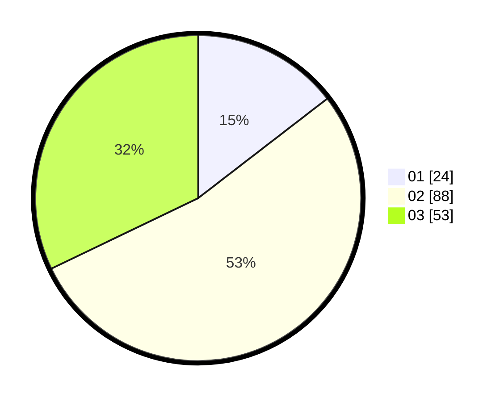

# Hasil

Hasil perolehan suara paslon dapat dilihat pada file paslon-01.txt, paslon-02.txt, dan paslon-03.txt.

Jika tidak ada, artinya data tersebut belum ada pada SIREKAP.

## Perolehan Suara

 * Paslon 01: **24**.
 * Paslon 02: **88**.
 * Paslon 03: **53**.

## Foto C Plano

https://sirekap-obj-formc.kpu.go.id/1420/pemilu/ppwp/31/71/04/10/01/3171041001006-20240214-203418--fbbc8557-3d20-4e06-b7a2-f9004cc51ef8.jpg

https://sirekap-obj-formc.kpu.go.id/1420/pemilu/ppwp/31/71/04/10/01/3171041001006-20240216-235222--cee1dad8-9b1f-4397-baa6-8d37f4071c38.jpg

https://sirekap-obj-formc.kpu.go.id/1420/pemilu/ppwp/31/71/04/10/01/3171041001006-20240216-235221--99913aba-4a54-4b35-a1fa-fecfdafdb6c9.jpg

## DATA PEMILIH TETAP

Jumlah pemilih dalam DPT: **258**.
 * L: **135**.
 * P: **123**.

## DATA PENGGUNA HAK PILIH

Jumlah pengguna hak pilih dalam DPT: **154**.
 * L: **80**.
 * P: **74**.

Jumlah pengguna hak pilih dalam DPTb: **14**.
 * L: **11**.
 * P: **3**.

Jumlah pengguna hak pilih dalam DPK: **0**.
 * L: **0**.
 * P: **0**.

Jumlah pengguna hak pilih: **168**.
 * L: **91**.
 * P: **77**.

## JUMLAH SUARA SAH DAN TIDAK SAH

JUMLAH SELURUH SUARA SAH: **165**.

JUMLAH SUARA TIDAK SAH: **3**.

JUMLAH SELURUH SUARA SAH DAN SUARA TIDAK SAH: **168**.
