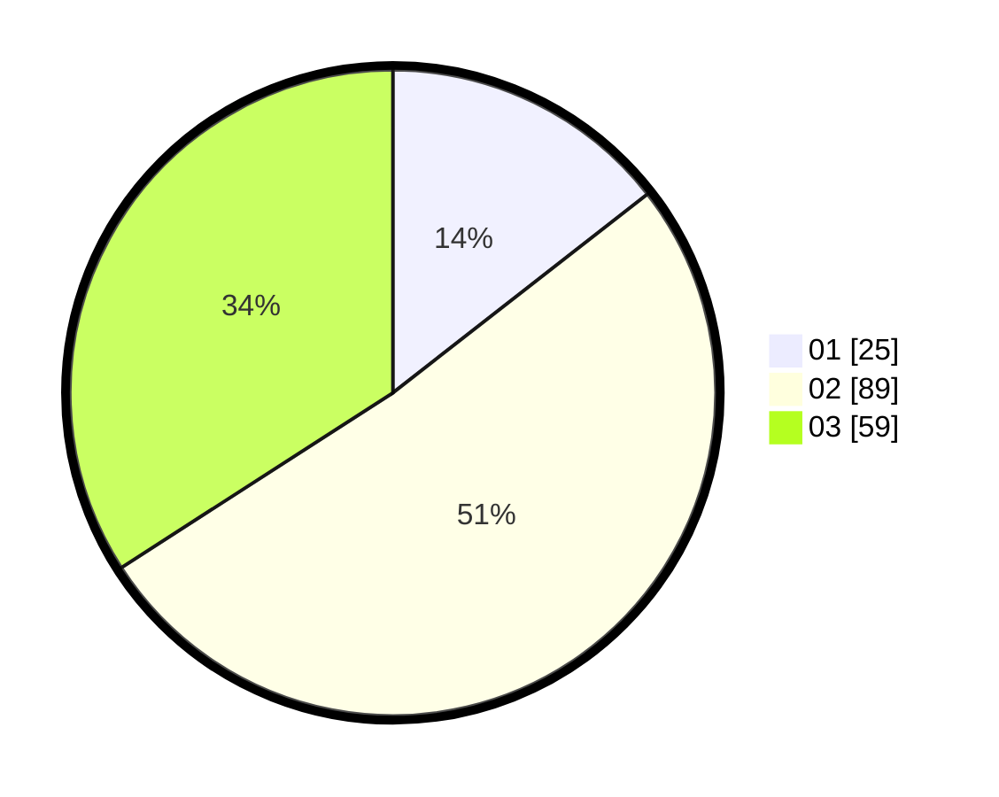

# Hasil

Hasil perolehan suara paslon dapat dilihat pada file paslon-01.txt, paslon-02.txt, dan paslon-03.txt.

Jika tidak ada, artinya data tersebut belum ada pada SIREKAP.

## Perolehan Suara

 * Paslon 01: **25**.
 * Paslon 02: **89**.
 * Paslon 03: **59**.

## Foto C Plano

https://sirekap-obj-formc.kpu.go.id/1d9b/pemilu/ppwp/31/71/04/10/01/3171041001010-20240216-145710--f5559057-17d5-4b8a-9464-992feb1ac052.jpg

https://sirekap-obj-formc.kpu.go.id/1d9b/pemilu/ppwp/31/71/04/10/01/3171041001010-20240216-145711--088e57c2-c619-4611-96e3-d68673725a9f.jpg

https://sirekap-obj-formc.kpu.go.id/1d9b/pemilu/ppwp/31/71/04/10/01/3171041001010-20240216-092324--f50a030b-ece2-431d-8ded-0ca60d6ad9cd.jpg

## DATA PEMILIH TETAP

Jumlah pemilih dalam DPT: **264**.
 * L: **133**.
 * P: **131**.

## DATA PENGGUNA HAK PILIH

Jumlah pengguna hak pilih dalam DPT: **174**.
 * L: **95**.
 * P: **79**.

Jumlah pengguna hak pilih dalam DPTb: **0**.
 * L: **0**.
 * P: **0**.

Jumlah pengguna hak pilih dalam DPK: **1**.
 * L: **0**.
 * P: **1**.

Jumlah pengguna hak pilih: **175**.
 * L: **95**.
 * P: **80**.

## JUMLAH SUARA SAH DAN TIDAK SAH

JUMLAH SELURUH SUARA SAH: **173**.

JUMLAH SUARA TIDAK SAH: **2**.

JUMLAH SELURUH SUARA SAH DAN SUARA TIDAK SAH: **175**.
