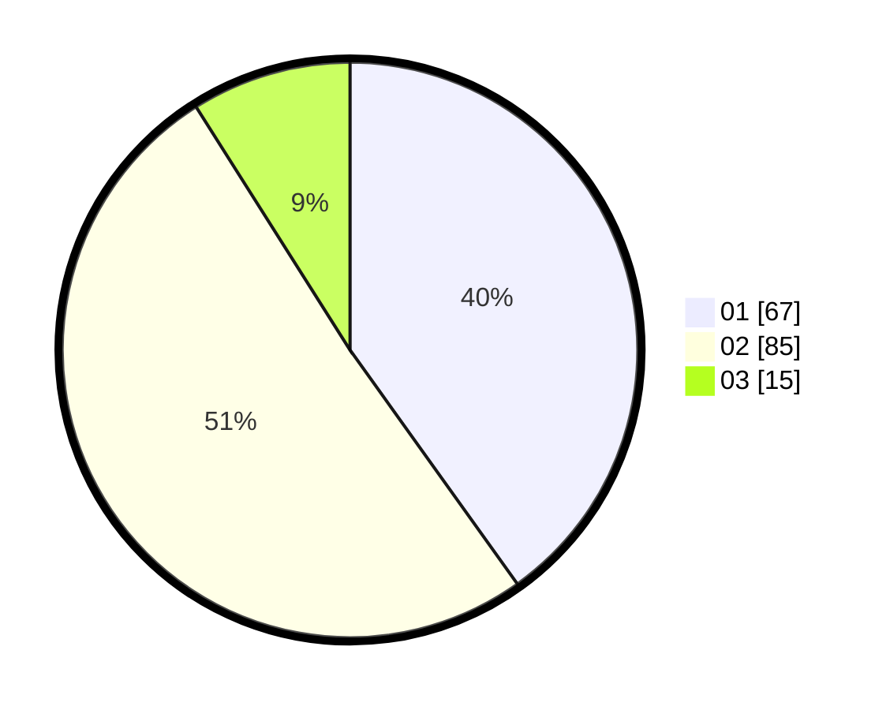

# Hasil

Hasil perolehan suara paslon dapat dilihat pada file paslon-01.txt, paslon-02.txt, dan paslon-03.txt.

Jika tidak ada, artinya data tersebut belum ada pada SIREKAP.

## Perolehan Suara

 * Paslon 01: **67**.
 * Paslon 02: **85**.
 * Paslon 03: **15**.

## Foto C Plano

https://sirekap-obj-formc.kpu.go.id/9844/pemilu/ppwp/31/71/04/10/01/3171041001012-20240217-171921--357b5109-8b97-4110-8775-417026265791.jpg

https://sirekap-obj-formc.kpu.go.id/9844/pemilu/ppwp/31/71/04/10/01/3171041001012-20240217-171922--763914e6-b3e1-44fa-bec4-d17e7db55bb6.jpg

https://sirekap-obj-formc.kpu.go.id/9844/pemilu/ppwp/31/71/04/10/01/3171041001012-20240217-171922--5cad41cd-3711-4c94-9b57-07cbadbcd7f4.jpg

## DATA PEMILIH TETAP

Jumlah pemilih dalam DPT: **250**.
 * L: **115**.
 * P: **135**.

## DATA PENGGUNA HAK PILIH

Jumlah pengguna hak pilih dalam DPT: **168**.
 * L: **72**.
 * P: **96**.

Jumlah pengguna hak pilih dalam DPTb: **0**.
 * L: **0**.
 * P: **0**.

Jumlah pengguna hak pilih dalam DPK: **0**.
 * L: **0**.
 * P: **0**.

Jumlah pengguna hak pilih: **168**.
 * L: **72**.
 * P: **96**.

## JUMLAH SUARA SAH DAN TIDAK SAH

JUMLAH SELURUH SUARA SAH: **167**.

JUMLAH SUARA TIDAK SAH: **1**.

JUMLAH SELURUH SUARA SAH DAN SUARA TIDAK SAH: **168**.
