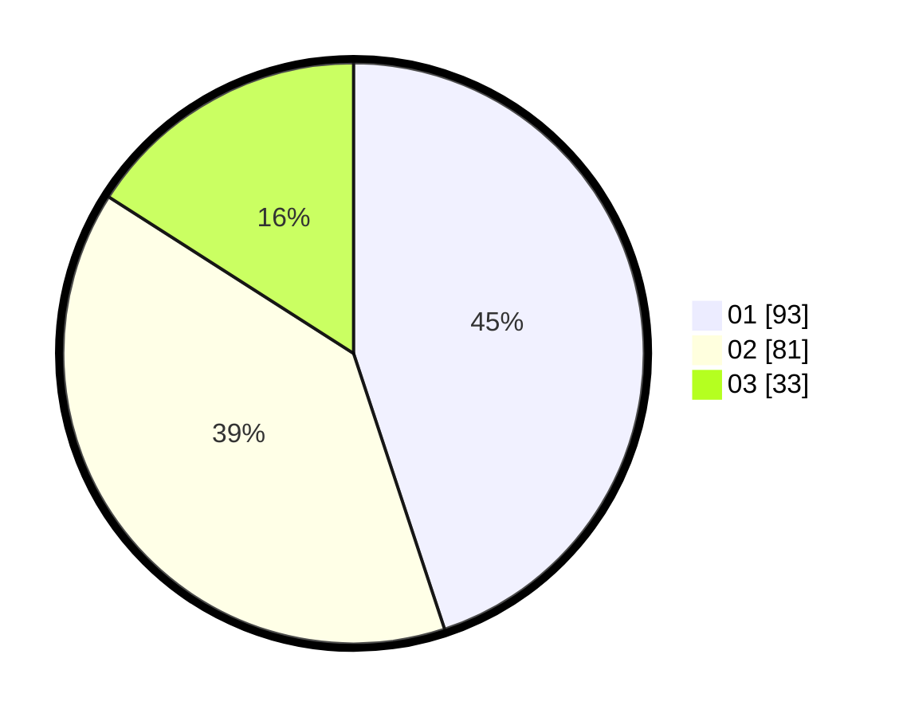

# Hasil

Hasil perolehan suara paslon dapat dilihat pada file paslon-01.txt, paslon-02.txt, dan paslon-03.txt.

Jika tidak ada, artinya data tersebut belum ada pada SIREKAP.

## Perolehan Suara

 * Paslon 01: **93**.
 * Paslon 02: **81**.
 * Paslon 03: **33**.

## Foto C Plano

https://sirekap-obj-formc.kpu.go.id/5540/pemilu/ppwp/31/71/04/10/01/3171041001014-20240216-100927--815770cb-a505-4dcf-a67b-fa307ae1b169.jpg

https://sirekap-obj-formc.kpu.go.id/5540/pemilu/ppwp/31/71/04/10/01/3171041001014-20240216-100949--adc9441c-022d-401f-9a6e-2815d43189a3.jpg

https://sirekap-obj-formc.kpu.go.id/5540/pemilu/ppwp/31/71/04/10/01/3171041001014-20240216-100938--2a76af8e-7bc2-4ac1-b3fe-46ce1c180d7f.jpg

## DATA PEMILIH TETAP

Jumlah pemilih dalam DPT: **280**.
 * L: **140**.
 * P: **140**.

## DATA PENGGUNA HAK PILIH

Jumlah pengguna hak pilih dalam DPT: **203**.
 * L: **95**.
 * P: **108**.

Jumlah pengguna hak pilih dalam DPTb: **10**.
 * L: **8**.
 * P: **2**.

Jumlah pengguna hak pilih dalam DPK: **0**.
 * L: **0**.
 * P: **0**.

Jumlah pengguna hak pilih: **213**.
 * L: **103**.
 * P: **110**.

## JUMLAH SUARA SAH DAN TIDAK SAH

JUMLAH SELURUH SUARA SAH: **207**.

JUMLAH SUARA TIDAK SAH: **6**.

JUMLAH SELURUH SUARA SAH DAN SUARA TIDAK SAH: **213**.
