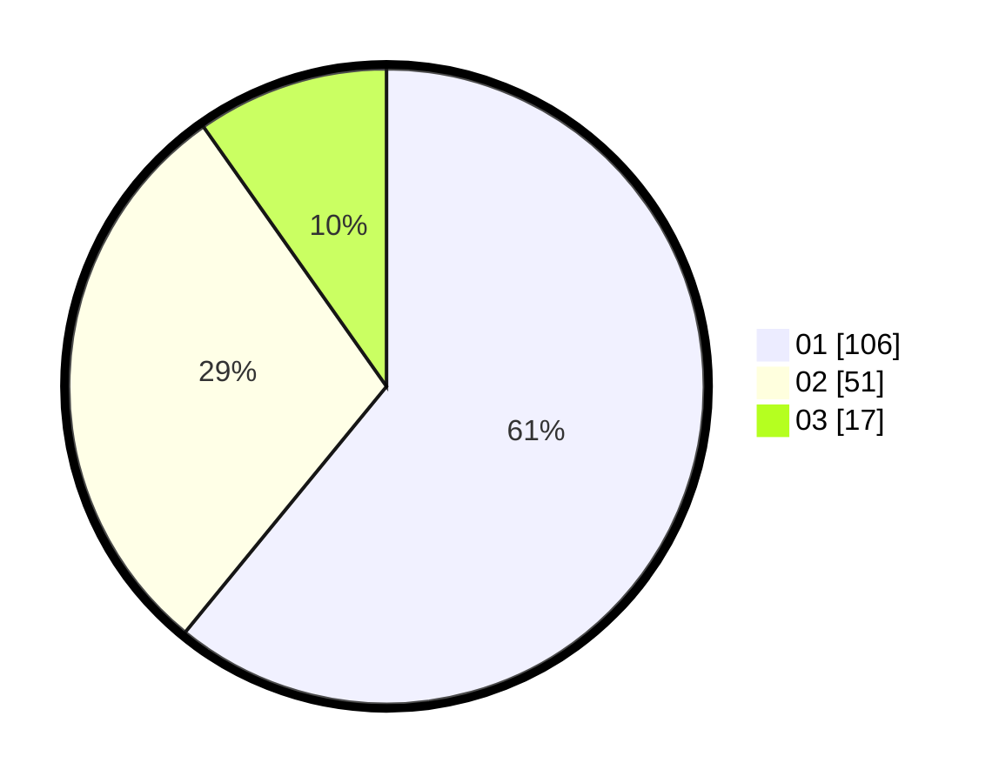

# Hasil

Hasil perolehan suara paslon dapat dilihat pada file paslon-01.txt, paslon-02.txt, dan paslon-03.txt.

Jika tidak ada, artinya data tersebut belum ada pada SIREKAP.

## Perolehan Suara

 * Paslon 01: **106**.
 * Paslon 02: **51**.
 * Paslon 03: **17**.

## Foto C Plano

https://sirekap-obj-formc.kpu.go.id/06dc/pemilu/ppwp/31/71/04/10/01/3171041001016-20240215-003757--ff330749-a7f3-406c-aec4-b0c588ad9905.jpg

https://sirekap-obj-formc.kpu.go.id/06dc/pemilu/ppwp/31/71/04/10/01/3171041001016-20240215-003908--e0f56baa-0e7b-47e8-a802-3a583be5bebb.jpg

https://sirekap-obj-formc.kpu.go.id/06dc/pemilu/ppwp/31/71/04/10/01/3171041001016-20240215-003204--55845478-ec08-476c-8c9f-6dca6fe24e81.jpg

## DATA PEMILIH TETAP

Jumlah pemilih dalam DPT: **226**.
 * L: **124**.
 * P: **102**.

## DATA PENGGUNA HAK PILIH

Jumlah pengguna hak pilih dalam DPT: **165**.
 * L: **85**.
 * P: **80**.

Jumlah pengguna hak pilih dalam DPTb: **11**.
 * L: **11**.
 * P: **0**.

Jumlah pengguna hak pilih dalam DPK: **1**.
 * L: **1**.
 * P: **0**.

Jumlah pengguna hak pilih: **177**.
 * L: **97**.
 * P: **80**.

## JUMLAH SUARA SAH DAN TIDAK SAH

JUMLAH SELURUH SUARA SAH: **174**.

JUMLAH SUARA TIDAK SAH: **3**.

JUMLAH SELURUH SUARA SAH DAN SUARA TIDAK SAH: **177**.
