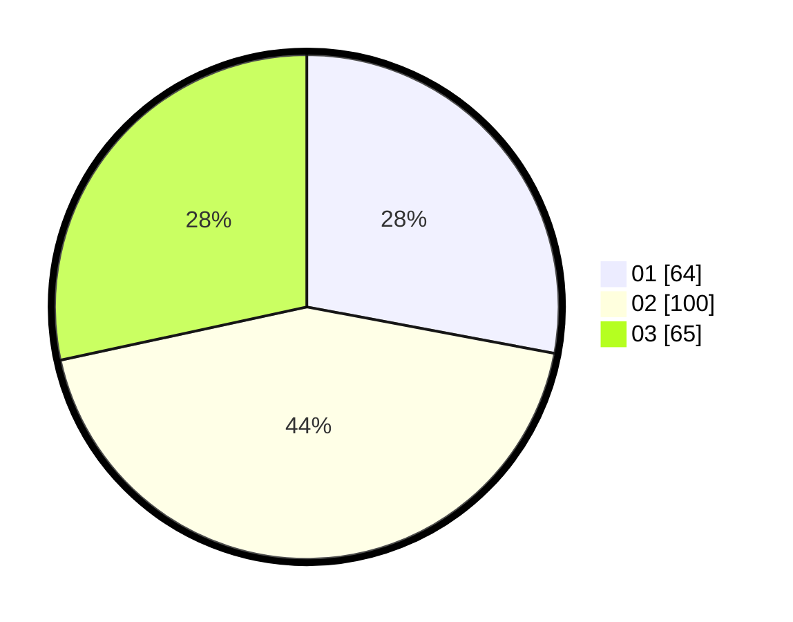

# Hasil

Hasil perolehan suara paslon dapat dilihat pada file paslon-01.txt, paslon-02.txt, dan paslon-03.txt.

Jika tidak ada, artinya data tersebut belum ada pada SIREKAP.

## Perolehan Suara

 * Paslon 01: **64**.
 * Paslon 02: **100**.
 * Paslon 03: **65**.

## Foto C Plano

https://sirekap-obj-formc.kpu.go.id/3dc2/pemilu/ppwp/31/71/04/10/02/3171041002004-20240214-200631--db915990-43b9-4633-851e-6c6fcd2246b5.jpg

https://sirekap-obj-formc.kpu.go.id/3dc2/pemilu/ppwp/31/71/04/10/02/3171041002004-20240214-200749--2e1eb0f1-13c5-4833-82ec-7246557799da.jpg

https://sirekap-obj-formc.kpu.go.id/3dc2/pemilu/ppwp/31/71/04/10/02/3171041002004-20240214-200915--b8d5b1b4-033e-4d0b-9def-23719d81ff67.jpg

## DATA PEMILIH TETAP

Jumlah pemilih dalam DPT: **295**.
 * L: **142**.
 * P: **153**.

## DATA PENGGUNA HAK PILIH

Jumlah pengguna hak pilih dalam DPT: **209**.
 * L: **98**.
 * P: **111**.

Jumlah pengguna hak pilih dalam DPTb: **20**.
 * L: **6**.
 * P: **14**.

Jumlah pengguna hak pilih dalam DPK: **3**.
 * L: **1**.
 * P: **2**.

Jumlah pengguna hak pilih: **232**.
 * L: **105**.
 * P: **127**.

## JUMLAH SUARA SAH DAN TIDAK SAH

JUMLAH SELURUH SUARA SAH: **229**.

JUMLAH SUARA TIDAK SAH: **3**.

JUMLAH SELURUH SUARA SAH DAN SUARA TIDAK SAH: **232**.
