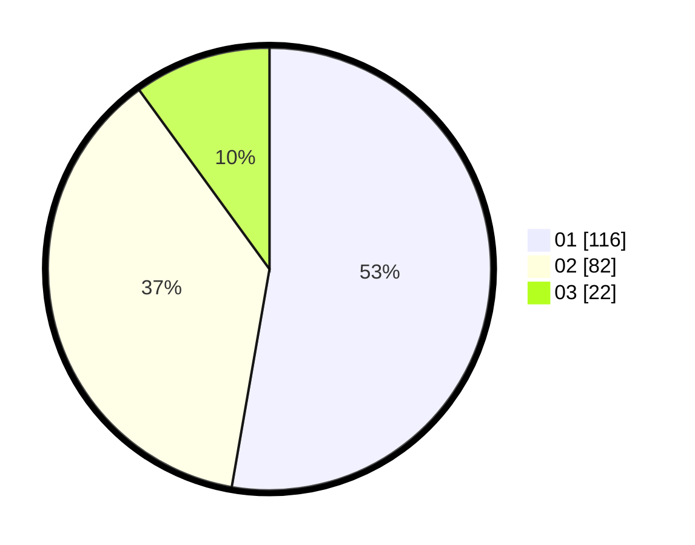

# Hasil

Hasil perolehan suara paslon dapat dilihat pada file paslon-01.txt, paslon-02.txt, dan paslon-03.txt.

Jika tidak ada, artinya data tersebut belum ada pada SIREKAP.

## Perolehan Suara

 * Paslon 01: **116**.
 * Paslon 02: **82**.
 * Paslon 03: **22**.

## Foto C Plano

https://sirekap-obj-formc.kpu.go.id/3316/pemilu/ppwp/31/71/04/10/02/3171041002006-20240214-233434--34838945-600c-4688-b0e8-636e6ee0b0ed.jpg

https://sirekap-obj-formc.kpu.go.id/3316/pemilu/ppwp/31/71/04/10/02/3171041002006-20240214-233631--47c3ee40-5c70-4788-a1ae-cf18ee1125a5.jpg

https://sirekap-obj-formc.kpu.go.id/3316/pemilu/ppwp/31/71/04/10/02/3171041002006-20240214-233826--c97ea1c1-1202-4537-81a1-5da29c283aa4.jpg

## DATA PEMILIH TETAP

Jumlah pemilih dalam DPT: **272**.
 * L: **143**.
 * P: **129**.

## DATA PENGGUNA HAK PILIH

Jumlah pengguna hak pilih dalam DPT: **197**.
 * L: **96**.
 * P: **101**.

Jumlah pengguna hak pilih dalam DPTb: **23**.
 * L: **12**.
 * P: **11**.

Jumlah pengguna hak pilih dalam DPK: **3**.
 * L: **2**.
 * P: **1**.

Jumlah pengguna hak pilih: **223**.
 * L: **110**.
 * P: **113**.

## JUMLAH SUARA SAH DAN TIDAK SAH

JUMLAH SELURUH SUARA SAH: **220**.

JUMLAH SUARA TIDAK SAH: **3**.

JUMLAH SELURUH SUARA SAH DAN SUARA TIDAK SAH: **223**.
