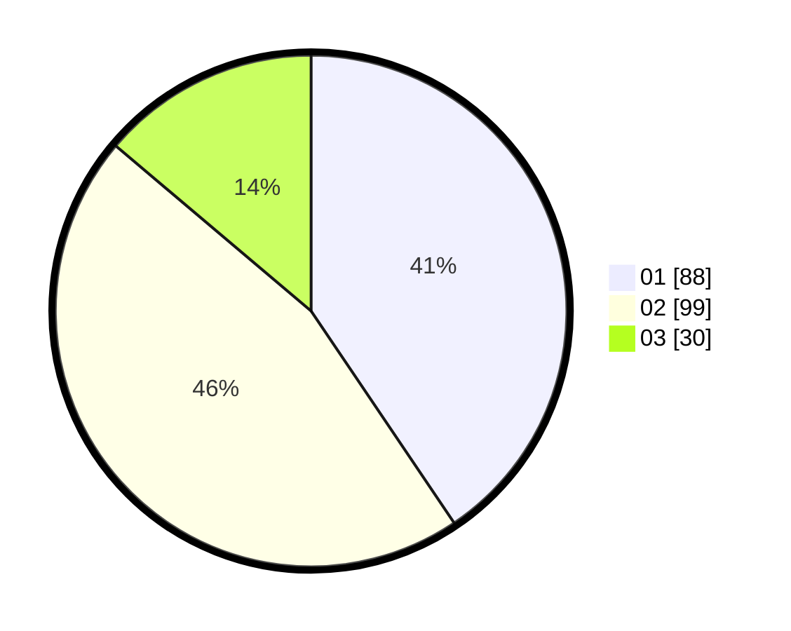

# Hasil

Hasil perolehan suara paslon dapat dilihat pada file paslon-01.txt, paslon-02.txt, dan paslon-03.txt.

Jika tidak ada, artinya data tersebut belum ada pada SIREKAP.

## Perolehan Suara

 * Paslon 01: **88**.
 * Paslon 02: **99**.
 * Paslon 03: **30**.

## Foto C Plano

https://sirekap-obj-formc.kpu.go.id/b987/pemilu/ppwp/31/71/04/10/02/3171041002007-20240216-150330--e02af64e-3338-4469-bace-9f63a8cf2575.jpg

https://sirekap-obj-formc.kpu.go.id/b987/pemilu/ppwp/31/71/04/10/02/3171041002007-20240216-150331--4443f30c-2f03-4cdb-b3ad-d706e7db2795.jpg

https://sirekap-obj-formc.kpu.go.id/b987/pemilu/ppwp/31/71/04/10/02/3171041002007-20240216-150331--36b17646-dcf6-4787-8d15-e44d46657bb2.jpg

## DATA PEMILIH TETAP

Jumlah pemilih dalam DPT: **203**.
 * L: **94**.
 * P: **109**.

## DATA PENGGUNA HAK PILIH

Jumlah pengguna hak pilih dalam DPT: **203**.
 * L: **94**.
 * P: **109**.

Jumlah pengguna hak pilih dalam DPTb: **16**.
 * L: **6**.
 * P: **10**.

Jumlah pengguna hak pilih dalam DPK: **0**.
 * L: **0**.
 * P: **0**.

Jumlah pengguna hak pilih: **219**.
 * L: **100**.
 * P: **119**.

## JUMLAH SUARA SAH DAN TIDAK SAH

JUMLAH SELURUH SUARA SAH: **217**.

JUMLAH SUARA TIDAK SAH: **2**.

JUMLAH SELURUH SUARA SAH DAN SUARA TIDAK SAH: **219**.
