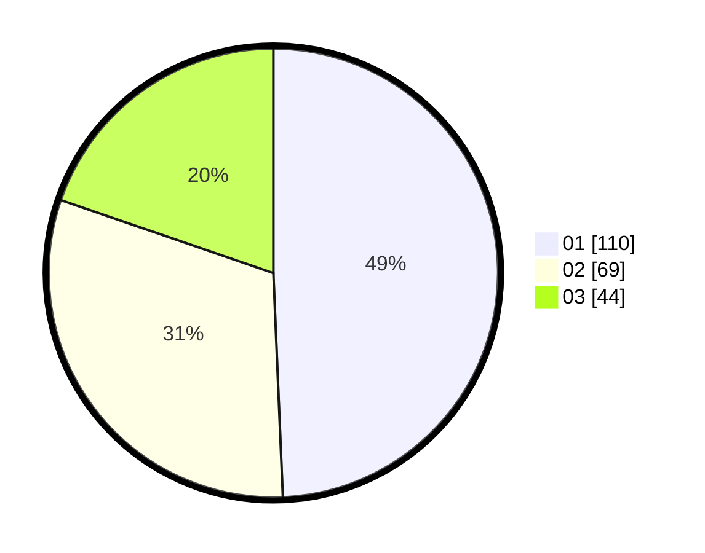

# Hasil

Hasil perolehan suara paslon dapat dilihat pada file paslon-01.txt, paslon-02.txt, dan paslon-03.txt.

Jika tidak ada, artinya data tersebut belum ada pada SIREKAP.

## Perolehan Suara

 * Paslon 01: **110**.
 * Paslon 02: **69**.
 * Paslon 03: **44**.

## Foto C Plano

https://sirekap-obj-formc.kpu.go.id/c81f/pemilu/ppwp/31/71/04/10/02/3171041002011-20240216-082618--526c7792-19c4-426b-be04-8c3bec3f6fd1.jpg

https://sirekap-obj-formc.kpu.go.id/c81f/pemilu/ppwp/31/71/04/10/02/3171041002011-20240216-082631--40493a67-fe89-48b2-8ce0-6a8e0b2286a8.jpg

https://sirekap-obj-formc.kpu.go.id/c81f/pemilu/ppwp/31/71/04/10/02/3171041002011-20240216-082626--41c938e0-e9cd-42f6-a2f3-51905526caa6.jpg

## DATA PEMILIH TETAP

Jumlah pemilih dalam DPT: **276**.
 * L: **144**.
 * P: **132**.

## DATA PENGGUNA HAK PILIH

Jumlah pengguna hak pilih dalam DPT: **276**.
 * L: **144**.
 * P: **132**.

Jumlah pengguna hak pilih dalam DPTb: **217**.
 * L: **103**.
 * P: **114**.

Jumlah pengguna hak pilih dalam DPK: **8**.
 * L: **3**.
 * P: **5**.

Jumlah pengguna hak pilih: **225**.
 * L: **106**.
 * P: **119**.

## JUMLAH SUARA SAH DAN TIDAK SAH

JUMLAH SELURUH SUARA SAH: **223**.

JUMLAH SUARA TIDAK SAH: **2**.

JUMLAH SELURUH SUARA SAH DAN SUARA TIDAK SAH: **225**.
