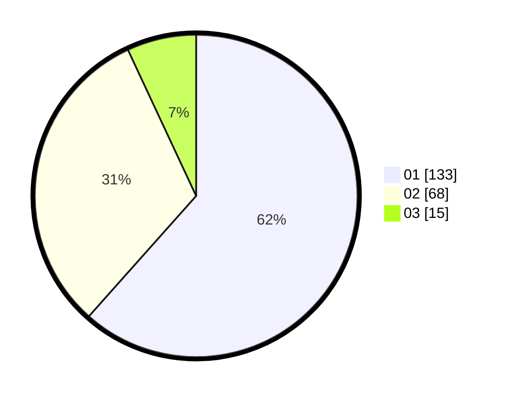

# Hasil

Hasil perolehan suara paslon dapat dilihat pada file paslon-01.txt, paslon-02.txt, dan paslon-03.txt.

Jika tidak ada, artinya data tersebut belum ada pada SIREKAP.

## Perolehan Suara

 * Paslon 01: **133**.
 * Paslon 02: **68**.
 * Paslon 03: **15**.

## Foto C Plano

https://sirekap-obj-formc.kpu.go.id/0fe4/pemilu/ppwp/31/71/04/10/02/3171041002015-20240214-211046--32dfd435-6506-48a4-b3f9-08e27377be28.jpg

https://sirekap-obj-formc.kpu.go.id/0fe4/pemilu/ppwp/31/71/04/10/02/3171041002015-20240216-174830--a3df1b48-1d7f-4131-bba5-e4977e2e7a5f.jpg

https://sirekap-obj-formc.kpu.go.id/0fe4/pemilu/ppwp/31/71/04/10/02/3171041002015-20240216-181150--26c6dcc6-2844-4062-a355-7dba068f31ff.jpg

## DATA PEMILIH TETAP

Jumlah pemilih dalam DPT: **272**.
 * L: **144**.
 * P: **128**.

## DATA PENGGUNA HAK PILIH

Jumlah pengguna hak pilih dalam DPT: **210**.
 * L: **110**.
 * P: **100**.

Jumlah pengguna hak pilih dalam DPTb: **6**.
 * L: **2**.
 * P: **4**.

Jumlah pengguna hak pilih dalam DPK: **3**.
 * L: **1**.
 * P: **2**.

Jumlah pengguna hak pilih: **219**.
 * L: **113**.
 * P: **106**.

## JUMLAH SUARA SAH DAN TIDAK SAH

JUMLAH SELURUH SUARA SAH: **216**.

JUMLAH SUARA TIDAK SAH: **3**.

JUMLAH SELURUH SUARA SAH DAN SUARA TIDAK SAH: **219**.
