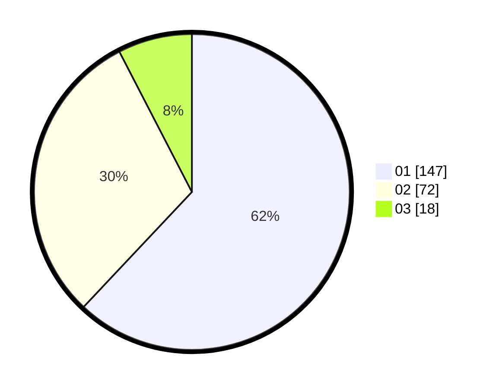

# Hasil

Hasil perolehan suara paslon dapat dilihat pada file paslon-01.txt, paslon-02.txt, dan paslon-03.txt.

Jika tidak ada, artinya data tersebut belum ada pada SIREKAP.

## Perolehan Suara

 * Paslon 01: **147**.
 * Paslon 02: **72**.
 * Paslon 03: **18**.

## Foto C Plano

https://sirekap-obj-formc.kpu.go.id/0dd7/pemilu/ppwp/31/71/04/10/02/3171041002016-20240218-115408--baa7dd97-bfb4-419c-891b-c9ad8a3c8e81.jpg

https://sirekap-obj-formc.kpu.go.id/0dd7/pemilu/ppwp/31/71/04/10/02/3171041002016-20240218-115053--722939ca-5b64-4059-bce1-cbb5b5e531eb.jpg

https://sirekap-obj-formc.kpu.go.id/0dd7/pemilu/ppwp/31/71/04/10/02/3171041002016-20240218-115151--31d92a11-02ea-4f18-b16a-42d940a64d99.jpg

## DATA PEMILIH TETAP

Jumlah pemilih dalam DPT: **278**.
 * L: **138**.
 * P: **140**.

## DATA PENGGUNA HAK PILIH

Jumlah pengguna hak pilih dalam DPT: **238**.
 * L: **114**.
 * P: **124**.

Jumlah pengguna hak pilih dalam DPTb: **4**.
 * L: **2**.
 * P: **2**.

Jumlah pengguna hak pilih dalam DPK: **1**.
 * L: **1**.
 * P: **0**.

Jumlah pengguna hak pilih: **243**.
 * L: **117**.
 * P: **126**.

## JUMLAH SUARA SAH DAN TIDAK SAH

JUMLAH SELURUH SUARA SAH: **237**.

JUMLAH SUARA TIDAK SAH: **6**.

JUMLAH SELURUH SUARA SAH DAN SUARA TIDAK SAH: **243**.
