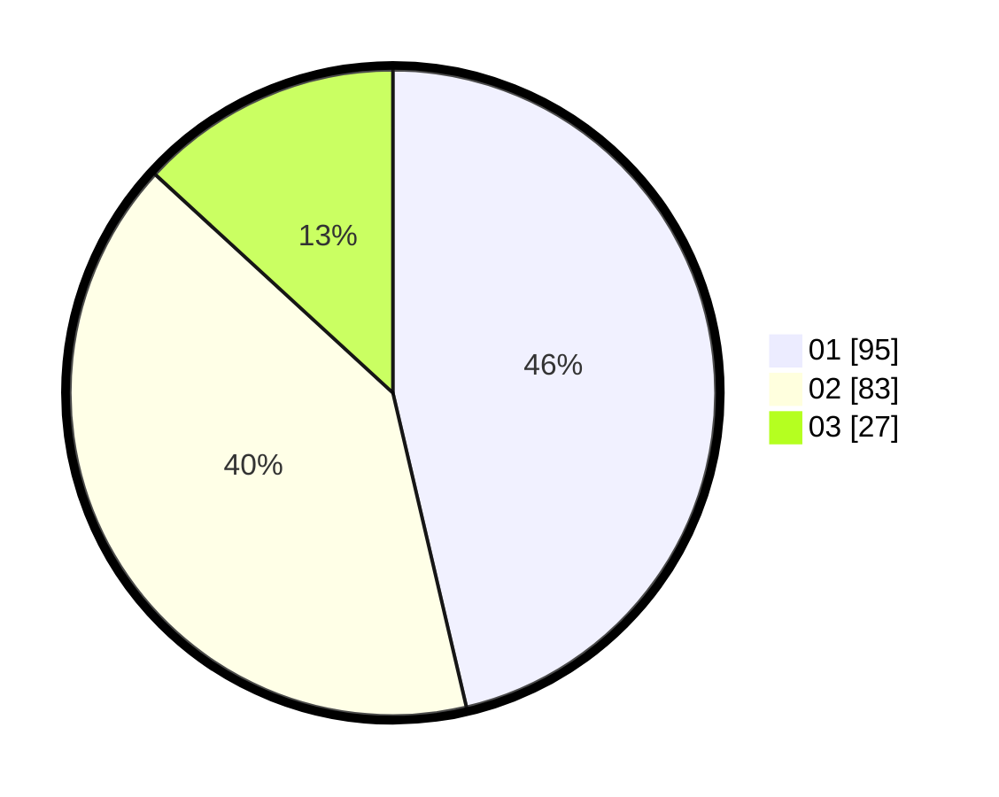

# Hasil

Hasil perolehan suara paslon dapat dilihat pada file paslon-01.txt, paslon-02.txt, dan paslon-03.txt.

Jika tidak ada, artinya data tersebut belum ada pada SIREKAP.

## Perolehan Suara

 * Paslon 01: **95**.
 * Paslon 02: **83**.
 * Paslon 03: **27**.

## Foto C Plano

https://sirekap-obj-formc.kpu.go.id/843c/pemilu/ppwp/31/71/04/10/02/3171041002017-20240216-150306--72cb0746-f5e9-46d4-afa1-cef1830b7929.jpg

https://sirekap-obj-formc.kpu.go.id/843c/pemilu/ppwp/31/71/04/10/02/3171041002017-20240216-143805--04bb229d-381c-412c-94cc-d8e07ff72c19.jpg

https://sirekap-obj-formc.kpu.go.id/843c/pemilu/ppwp/31/71/04/10/02/3171041002017-20240216-150307--4bd8cd98-e8f9-4da7-b26e-aebf9d937ce6.jpg

## DATA PEMILIH TETAP

Jumlah pemilih dalam DPT: **263**.
 * L: **132**.
 * P: **131**.

## DATA PENGGUNA HAK PILIH

Jumlah pengguna hak pilih dalam DPT: **208**.
 * L: **99**.
 * P: **109**.

Jumlah pengguna hak pilih dalam DPTb: **3**.
 * L: **2**.
 * P: **1**.

Jumlah pengguna hak pilih dalam DPK: **0**.
 * L: **0**.
 * P: **0**.

Jumlah pengguna hak pilih: **211**.
 * L: **101**.
 * P: **110**.

## JUMLAH SUARA SAH DAN TIDAK SAH

JUMLAH SELURUH SUARA SAH: **205**.

JUMLAH SUARA TIDAK SAH: **6**.

JUMLAH SELURUH SUARA SAH DAN SUARA TIDAK SAH: **211**.
