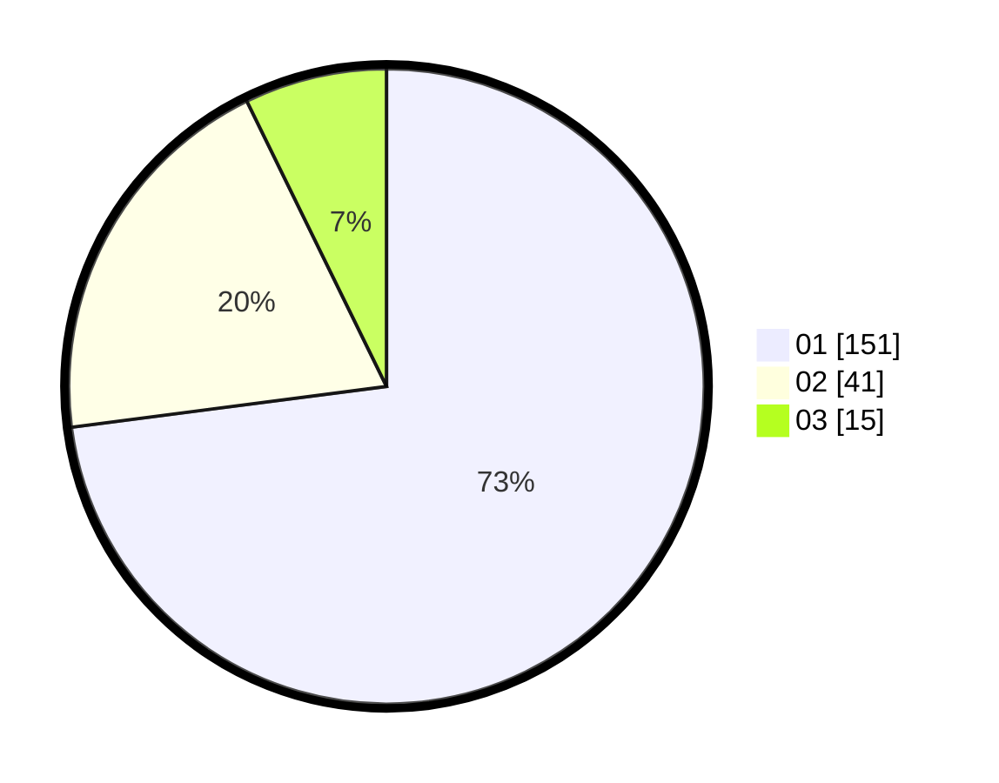

# Hasil

Hasil perolehan suara paslon dapat dilihat pada file paslon-01.txt, paslon-02.txt, dan paslon-03.txt.

Jika tidak ada, artinya data tersebut belum ada pada SIREKAP.

## Perolehan Suara

 * Paslon 01: **151**.
 * Paslon 02: **41**.
 * Paslon 03: **15**.

## Foto C Plano

https://sirekap-obj-formc.kpu.go.id/e8a2/pemilu/ppwp/31/71/04/10/02/3171041002020-20240214-194757--4ebd51a9-4845-4c05-aa5c-a8fe26f5ee19.jpg

https://sirekap-obj-formc.kpu.go.id/e8a2/pemilu/ppwp/31/71/04/10/02/3171041002020-20240214-194803--bb5af601-0107-4b86-9fde-bc85f91d160a.jpg

https://sirekap-obj-formc.kpu.go.id/e8a2/pemilu/ppwp/31/71/04/10/02/3171041002020-20240214-194811--e8b553ec-2f4f-4b87-bd81-f4578629292a.jpg

## DATA PEMILIH TETAP

Jumlah pemilih dalam DPT: **282**.
 * L: **140**.
 * P: **142**.

## DATA PENGGUNA HAK PILIH

Jumlah pengguna hak pilih dalam DPT: **212**.
 * L: **105**.
 * P: **107**.

Jumlah pengguna hak pilih dalam DPTb: **0**.
 * L: **0**.
 * P: **0**.

Jumlah pengguna hak pilih dalam DPK: **0**.
 * L: **0**.
 * P: **0**.

Jumlah pengguna hak pilih: **212**.
 * L: **105**.
 * P: **107**.

## JUMLAH SUARA SAH DAN TIDAK SAH

JUMLAH SELURUH SUARA SAH: **207**.

JUMLAH SUARA TIDAK SAH: **5**.

JUMLAH SELURUH SUARA SAH DAN SUARA TIDAK SAH: **212**.
