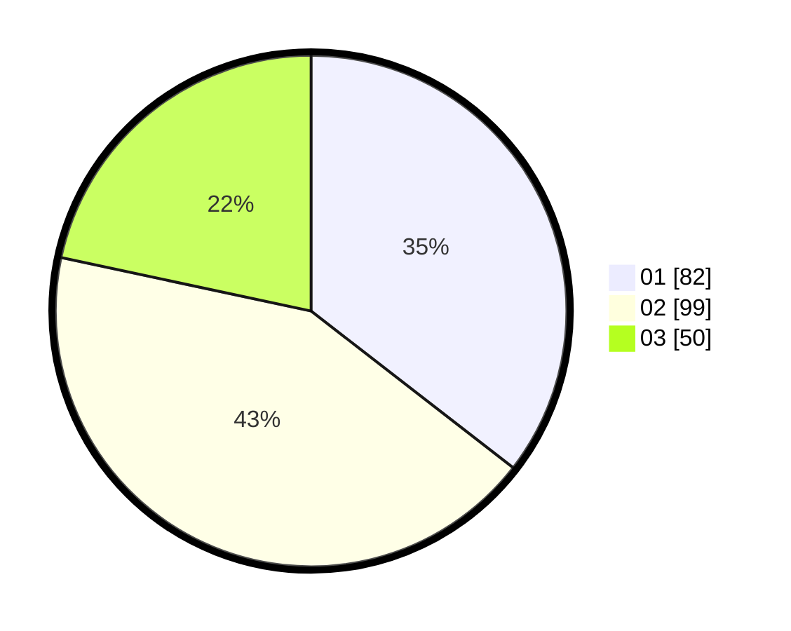

# Hasil

Hasil perolehan suara paslon dapat dilihat pada file paslon-01.txt, paslon-02.txt, dan paslon-03.txt.

Jika tidak ada, artinya data tersebut belum ada pada SIREKAP.

## Perolehan Suara

 * Paslon 01: **82**.
 * Paslon 02: **99**.
 * Paslon 03: **50**.

## Foto C Plano

https://sirekap-obj-formc.kpu.go.id/60f8/pemilu/ppwp/31/71/04/10/02/3171041002022-20240216-033941--071cd111-e708-40f6-937b-431876ebad9e.jpg

https://sirekap-obj-formc.kpu.go.id/60f8/pemilu/ppwp/31/71/04/10/02/3171041002022-20240216-033959--207a04cc-5ae2-4428-b0d3-f0966381e03a.jpg

https://sirekap-obj-formc.kpu.go.id/60f8/pemilu/ppwp/31/71/04/10/02/3171041002022-20240216-035444--94198d6a-f2b2-4deb-938c-bd9843fe8df1.jpg

## DATA PEMILIH TETAP

Jumlah pemilih dalam DPT: **255**.
 * L: **133**.
 * P: **122**.

## DATA PENGGUNA HAK PILIH

Jumlah pengguna hak pilih dalam DPT: **220**.
 * L: **113**.
 * P: **107**.

Jumlah pengguna hak pilih dalam DPTb: **14**.
 * L: **5**.
 * P: **9**.

Jumlah pengguna hak pilih dalam DPK: **1**.
 * L: **1**.
 * P: **0**.

Jumlah pengguna hak pilih: **235**.
 * L: **119**.
 * P: **116**.

## JUMLAH SUARA SAH DAN TIDAK SAH

JUMLAH SELURUH SUARA SAH: **231**.

JUMLAH SUARA TIDAK SAH: **4**.

JUMLAH SELURUH SUARA SAH DAN SUARA TIDAK SAH: **235**.
