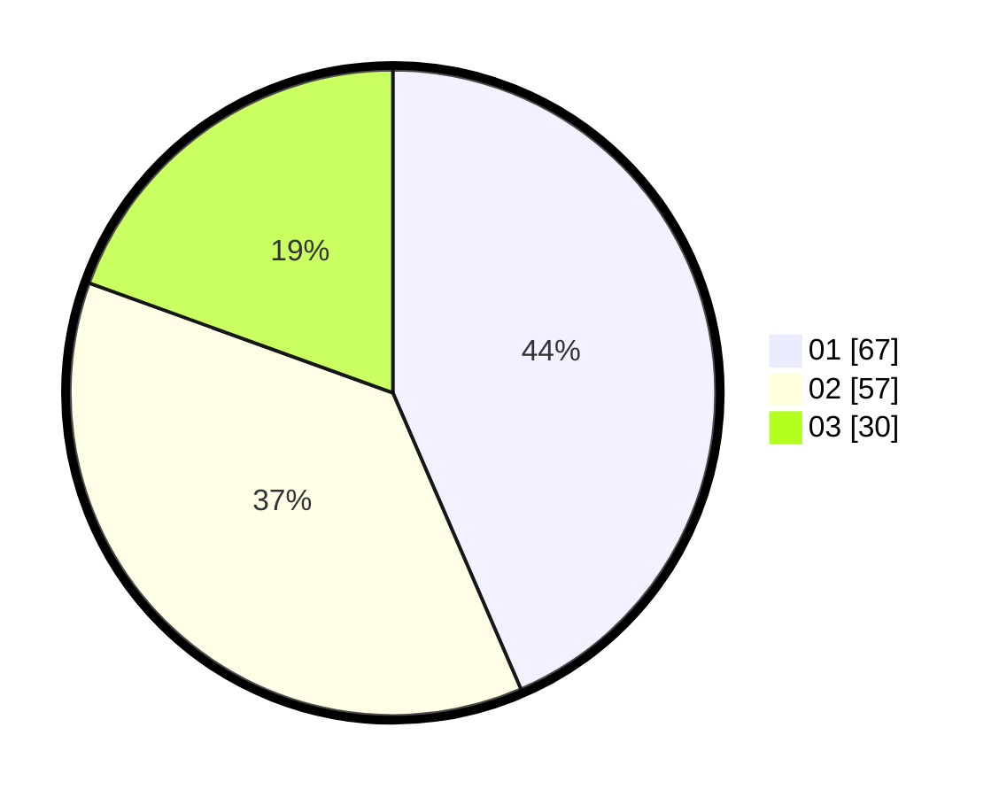

# Hasil

Hasil perolehan suara paslon dapat dilihat pada file paslon-01.txt, paslon-02.txt, dan paslon-03.txt.

Jika tidak ada, artinya data tersebut belum ada pada SIREKAP.

## Perolehan Suara

 * Paslon 01: **67**.
 * Paslon 02: **57**.
 * Paslon 03: **30**.

## Foto C Plano

https://sirekap-obj-formc.kpu.go.id/6bbf/pemilu/ppwp/31/71/04/10/02/3171041002028-20240214-205805--7ca53ce5-103f-450d-b109-a735f90f02a8.jpg

https://sirekap-obj-formc.kpu.go.id/6bbf/pemilu/ppwp/31/71/04/10/02/3171041002028-20240218-144018--a6beac67-45cf-49e1-a4be-23fd069f6cc2.jpg

https://sirekap-obj-formc.kpu.go.id/6bbf/pemilu/ppwp/31/71/04/10/02/3171041002028-20240218-144155--383de3ca-a9b0-47c1-bca3-db402bc5a6fe.jpg

## DATA PEMILIH TETAP

Jumlah pemilih dalam DPT: **210**.
 * L: **110**.
 * P: **100**.

## DATA PENGGUNA HAK PILIH

Jumlah pengguna hak pilih dalam DPT: **142**.
 * L: **74**.
 * P: **68**.

Jumlah pengguna hak pilih dalam DPTb: **14**.
 * L: **8**.
 * P: **6**.

Jumlah pengguna hak pilih dalam DPK: **0**.
 * L: **0**.
 * P: **0**.

Jumlah pengguna hak pilih: **156**.
 * L: **82**.
 * P: **74**.

## JUMLAH SUARA SAH DAN TIDAK SAH

JUMLAH SELURUH SUARA SAH: **154**.

JUMLAH SUARA TIDAK SAH: **2**.

JUMLAH SELURUH SUARA SAH DAN SUARA TIDAK SAH: **156**.
