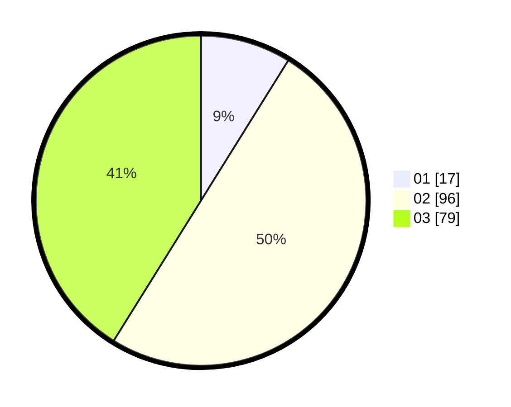

# Hasil

Hasil perolehan suara paslon dapat dilihat pada file paslon-01.txt, paslon-02.txt, dan paslon-03.txt.

Jika tidak ada, artinya data tersebut belum ada pada SIREKAP.

## Perolehan Suara

 * Paslon 01: **17**.
 * Paslon 02: **96**.
 * Paslon 03: **79**.

## Foto C Plano

https://sirekap-obj-formc.kpu.go.id/e385/pemilu/ppwp/31/71/04/10/02/3171041002031-20240214-203306--ab422ed6-4cce-4869-abd3-e42745fe1212.jpg

https://sirekap-obj-formc.kpu.go.id/e385/pemilu/ppwp/31/71/04/10/02/3171041002031-20240214-203341--702eee1d-7546-4ae1-97e8-5d32cbadbc2b.jpg

https://sirekap-obj-formc.kpu.go.id/e385/pemilu/ppwp/31/71/04/10/02/3171041002031-20240214-203406--39858560-9fc5-4611-b458-6bc569d944e0.jpg

## DATA PEMILIH TETAP

Jumlah pemilih dalam DPT: **277**.
 * L: **140**.
 * P: **137**.

## DATA PENGGUNA HAK PILIH

Jumlah pengguna hak pilih dalam DPT: **185**.
 * L: **87**.
 * P: **98**.

Jumlah pengguna hak pilih dalam DPTb: **7**.
 * L: **3**.
 * P: **4**.

Jumlah pengguna hak pilih dalam DPK: **3**.
 * L: **2**.
 * P: **1**.

Jumlah pengguna hak pilih: **195**.
 * L: **92**.
 * P: **103**.

## JUMLAH SUARA SAH DAN TIDAK SAH

JUMLAH SELURUH SUARA SAH: **192**.

JUMLAH SUARA TIDAK SAH: **3**.

JUMLAH SELURUH SUARA SAH DAN SUARA TIDAK SAH: **195**.
