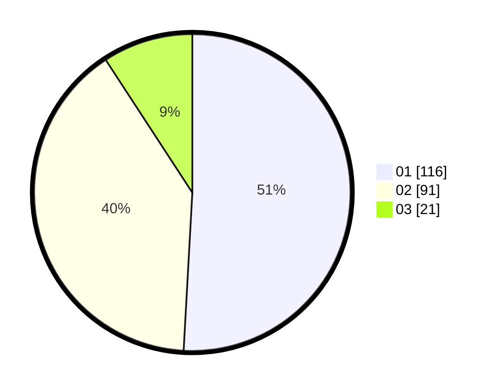

# Hasil

Hasil perolehan suara paslon dapat dilihat pada file paslon-01.txt, paslon-02.txt, dan paslon-03.txt.

Jika tidak ada, artinya data tersebut belum ada pada SIREKAP.

## Perolehan Suara

 * Paslon 01: **116**.
 * Paslon 02: **91**.
 * Paslon 03: **21**.

## Foto C Plano

https://sirekap-obj-formc.kpu.go.id/314d/pemilu/ppwp/31/71/04/10/02/3171041002901-20240214-223816--dd1090a0-ad8b-48c2-96d4-26ea5de85c9b.jpg

https://sirekap-obj-formc.kpu.go.id/314d/pemilu/ppwp/31/71/04/10/02/3171041002901-20240214-224016--c0a8cba2-c71c-48f0-b6a1-2dfe9fb2abc4.jpg

https://sirekap-obj-formc.kpu.go.id/314d/pemilu/ppwp/31/71/04/10/02/3171041002901-20240214-224148--a5c5fb2f-9529-4a9a-9729-8ac631aa0d58.jpg

## DATA PEMILIH TETAP

Jumlah pemilih dalam DPT: **235**.
 * L: **61**.
 * P: **174**.

## DATA PENGGUNA HAK PILIH

Jumlah pengguna hak pilih dalam DPT: **128**.
 * L: **34**.
 * P: **94**.

Jumlah pengguna hak pilih dalam DPTb: **101**.
 * L: **42**.
 * P: **59**.

Jumlah pengguna hak pilih dalam DPK: **0**.
 * L: **0**.
 * P: **0**.

Jumlah pengguna hak pilih: **229**.
 * L: **76**.
 * P: **153**.

## JUMLAH SUARA SAH DAN TIDAK SAH

JUMLAH SELURUH SUARA SAH: **228**.

JUMLAH SUARA TIDAK SAH: **1**.

JUMLAH SELURUH SUARA SAH DAN SUARA TIDAK SAH: **229**.
