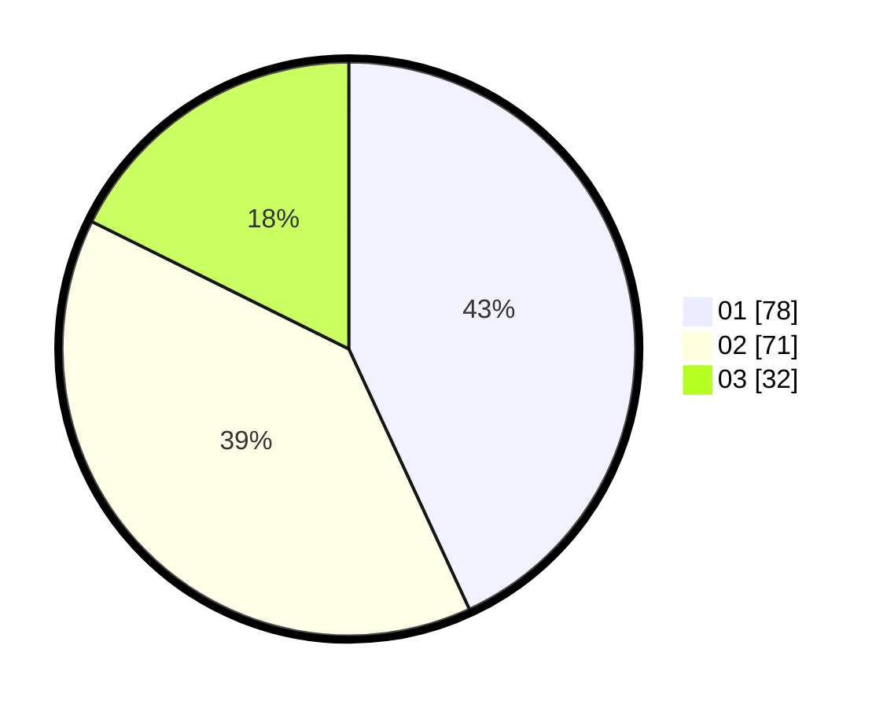

# Hasil

Hasil perolehan suara paslon dapat dilihat pada file paslon-01.txt, paslon-02.txt, dan paslon-03.txt.

Jika tidak ada, artinya data tersebut belum ada pada SIREKAP.

## Perolehan Suara

 * Paslon 01: **78**.
 * Paslon 02: **71**.
 * Paslon 03: **32**.

## Foto C Plano

https://sirekap-obj-formc.kpu.go.id/56c0/pemilu/ppwp/31/71/04/10/03/3171041003001-20240216-154929--77edd06f-9e4c-4771-8984-c00a30dd9bdc.jpg

https://sirekap-obj-formc.kpu.go.id/56c0/pemilu/ppwp/31/71/04/10/03/3171041003001-20240216-154930--3b11ee47-a2bf-49ab-9772-3fc4c56ec760.jpg

https://sirekap-obj-formc.kpu.go.id/56c0/pemilu/ppwp/31/71/04/10/03/3171041003001-20240216-154929--b0fd9d61-9d70-467b-a6cf-e0475a915efa.jpg

## DATA PEMILIH TETAP

Jumlah pemilih dalam DPT: **235**.
 * L: **112**.
 * P: **123**.

## DATA PENGGUNA HAK PILIH

Jumlah pengguna hak pilih dalam DPT: **164**.
 * L: **74**.
 * P: **90**.

Jumlah pengguna hak pilih dalam DPTb: **18**.
 * L: **8**.
 * P: **10**.

Jumlah pengguna hak pilih dalam DPK: **3**.
 * L: **1**.
 * P: **2**.

Jumlah pengguna hak pilih: **185**.
 * L: **83**.
 * P: **102**.

## JUMLAH SUARA SAH DAN TIDAK SAH

JUMLAH SELURUH SUARA SAH: **181**.

JUMLAH SUARA TIDAK SAH: **4**.

JUMLAH SELURUH SUARA SAH DAN SUARA TIDAK SAH: **185**.
