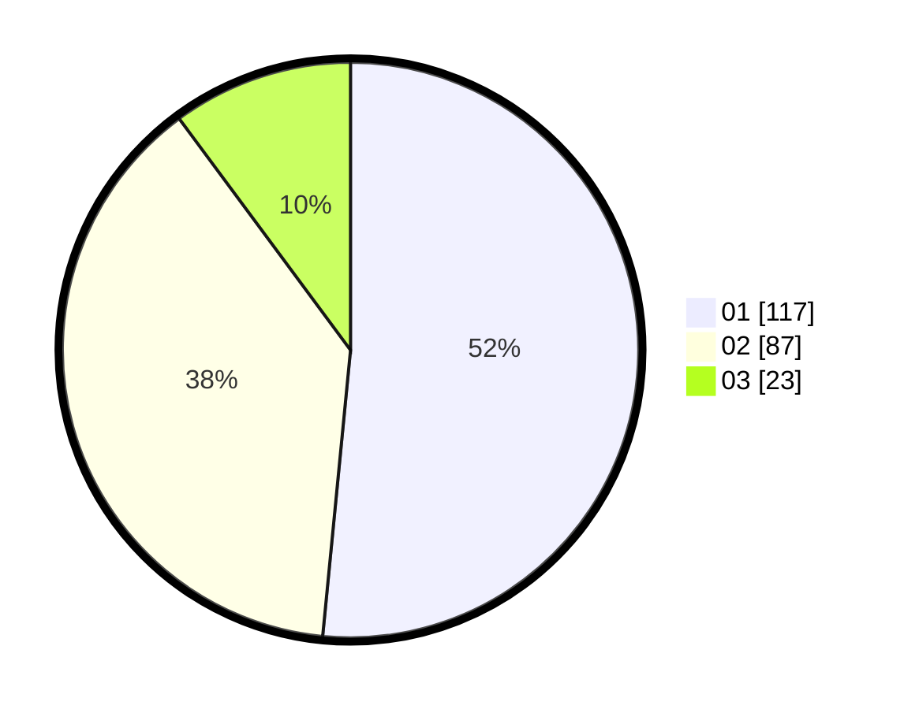

# Hasil

Hasil perolehan suara paslon dapat dilihat pada file paslon-01.txt, paslon-02.txt, dan paslon-03.txt.

Jika tidak ada, artinya data tersebut belum ada pada SIREKAP.

## Perolehan Suara

 * Paslon 01: **117**.
 * Paslon 02: **87**.
 * Paslon 03: **23**.

## Foto C Plano

https://sirekap-obj-formc.kpu.go.id/7b59/pemilu/ppwp/31/71/04/10/03/3171041003003-20240214-190312--71fdec85-c549-4e44-b045-da803b3f9a9a.jpg

https://sirekap-obj-formc.kpu.go.id/7b59/pemilu/ppwp/31/71/04/10/03/3171041003003-20240214-191917--b1f18578-c310-40d0-8fd2-0f3dae46d274.jpg

https://sirekap-obj-formc.kpu.go.id/7b59/pemilu/ppwp/31/71/04/10/03/3171041003003-20240214-194232--4283c585-a5a3-4d58-93a7-b7a369333add.jpg

## DATA PEMILIH TETAP

Jumlah pemilih dalam DPT: **277**.
 * L: **134**.
 * P: **143**.

## DATA PENGGUNA HAK PILIH

Jumlah pengguna hak pilih dalam DPT: **216**.
 * L: **96**.
 * P: **120**.

Jumlah pengguna hak pilih dalam DPTb: **12**.
 * L: **2**.
 * P: **10**.

Jumlah pengguna hak pilih dalam DPK: **4**.
 * L: **2**.
 * P: **2**.

Jumlah pengguna hak pilih: **232**.
 * L: **100**.
 * P: **132**.

## JUMLAH SUARA SAH DAN TIDAK SAH

JUMLAH SELURUH SUARA SAH: **227**.

JUMLAH SUARA TIDAK SAH: **5**.

JUMLAH SELURUH SUARA SAH DAN SUARA TIDAK SAH: **232**.
