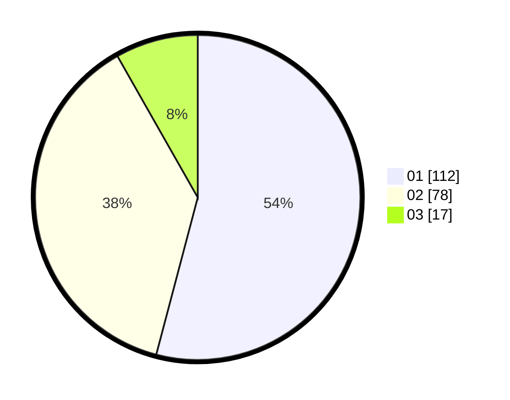

# Hasil

Hasil perolehan suara paslon dapat dilihat pada file paslon-01.txt, paslon-02.txt, dan paslon-03.txt.

Jika tidak ada, artinya data tersebut belum ada pada SIREKAP.

## Perolehan Suara

 * Paslon 01: **112**.
 * Paslon 02: **78**.
 * Paslon 03: **17**.

## Foto C Plano

https://sirekap-obj-formc.kpu.go.id/224c/pemilu/ppwp/31/71/04/10/03/3171041003005-20240214-193424--a2f01b1f-dab6-4460-8470-33bf670b253c.jpg

https://sirekap-obj-formc.kpu.go.id/224c/pemilu/ppwp/31/71/04/10/03/3171041003005-20240214-194303--6ecdbbc5-003e-4ef6-9a9e-75af8c87bcc8.jpg
