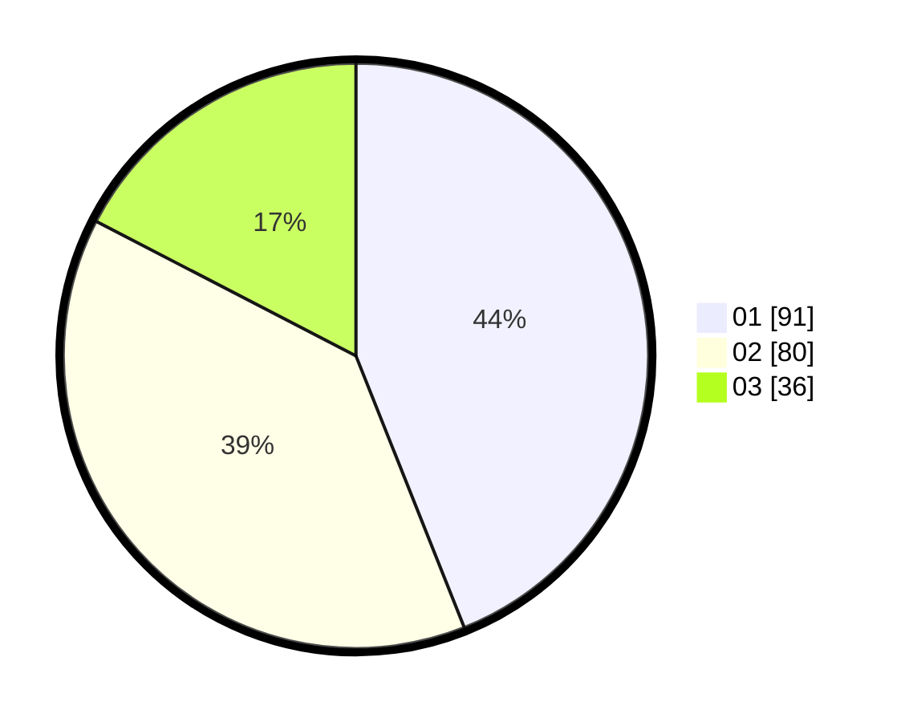

# Hasil

Hasil perolehan suara paslon dapat dilihat pada file paslon-01.txt, paslon-02.txt, dan paslon-03.txt.

Jika tidak ada, artinya data tersebut belum ada pada SIREKAP.

## Perolehan Suara

 * Paslon 01: **91**.
 * Paslon 02: **80**.
 * Paslon 03: **36**.

## Foto C Plano

https://sirekap-obj-formc.kpu.go.id/4d29/pemilu/ppwp/31/71/04/10/03/3171041003012-20240214-155711--c03df919-4855-4fc5-8943-d7b055ffc328.jpg

https://sirekap-obj-formc.kpu.go.id/4d29/pemilu/ppwp/31/71/04/10/03/3171041003012-20240214-155720--51eee50b-eddf-4d46-92f7-7d03b44606c4.jpg

https://sirekap-obj-formc.kpu.go.id/4d29/pemilu/ppwp/31/71/04/10/03/3171041003012-20240215-003937--a54c871e-3696-4d4c-b2aa-9ab4a398e5a9.jpg

## DATA PEMILIH TETAP

Jumlah pemilih dalam DPT: **279**.
 * L: **138**.
 * P: **141**.

## DATA PENGGUNA HAK PILIH

Jumlah pengguna hak pilih dalam DPT: **206**.
 * L: **104**.
 * P: **102**.

Jumlah pengguna hak pilih dalam DPTb: **1**.
 * L: **1**.
 * P: **0**.

Jumlah pengguna hak pilih dalam DPK: **0**.
 * L: **0**.
 * P: **0**.

Jumlah pengguna hak pilih: **207**.
 * L: **105**.
 * P: **102**.

## JUMLAH SUARA SAH DAN TIDAK SAH

JUMLAH SELURUH SUARA SAH: **207**.

JUMLAH SUARA TIDAK SAH: **0**.

JUMLAH SELURUH SUARA SAH DAN SUARA TIDAK SAH: **207**.
