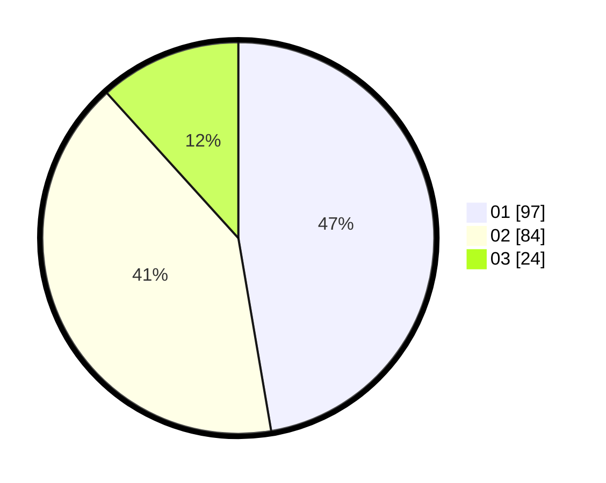

# Hasil

Hasil perolehan suara paslon dapat dilihat pada file paslon-01.txt, paslon-02.txt, dan paslon-03.txt.

Jika tidak ada, artinya data tersebut belum ada pada SIREKAP.

## Perolehan Suara

 * Paslon 01: **97**.
 * Paslon 02: **84**.
 * Paslon 03: **24**.

## Foto C Plano

https://sirekap-obj-formc.kpu.go.id/6689/pemilu/ppwp/31/71/04/10/03/3171041003020-20240214-214142--6fe1f571-c89b-449b-b17e-cc8ab4429583.jpg

https://sirekap-obj-formc.kpu.go.id/6689/pemilu/ppwp/31/71/04/10/03/3171041003020-20240214-221531--33c07763-0e68-49fb-a3b8-03c9cfa88e56.jpg

https://sirekap-obj-formc.kpu.go.id/6689/pemilu/ppwp/31/71/04/10/03/3171041003020-20240214-221607--4b2c34bc-64ab-463d-94c1-e52a30da091b.jpg
