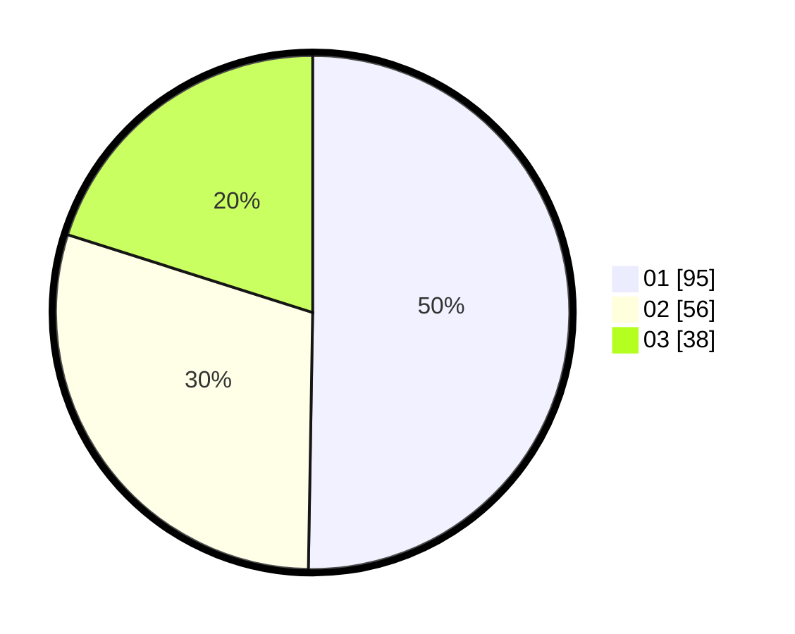

# Hasil

Hasil perolehan suara paslon dapat dilihat pada file paslon-01.txt, paslon-02.txt, dan paslon-03.txt.

Jika tidak ada, artinya data tersebut belum ada pada SIREKAP.

## Perolehan Suara

 * Paslon 01: **95**.
 * Paslon 02: **56**.
 * Paslon 03: **38**.

## Foto C Plano

https://sirekap-obj-formc.kpu.go.id/95e7/pemilu/ppwp/31/71/04/10/03/3171041003025-20240214-215353--3344613e-6d76-4693-9ea7-fe3f771b8fb7.jpg

https://sirekap-obj-formc.kpu.go.id/95e7/pemilu/ppwp/31/71/04/10/03/3171041003025-20240214-184839--dc83e1c5-cbc9-4ff6-86f0-64699b09c80e.jpg

https://sirekap-obj-formc.kpu.go.id/95e7/pemilu/ppwp/31/71/04/10/03/3171041003025-20240214-184846--481771ca-13c6-4c39-a213-6d2769541114.jpg

## DATA PEMILIH TETAP

Jumlah pemilih dalam DPT: **257**.
 * L: **129**.
 * P: **128**.

## DATA PENGGUNA HAK PILIH

Jumlah pengguna hak pilih dalam DPT: **174**.
 * L: **86**.
 * P: **88**.

Jumlah pengguna hak pilih dalam DPTb: **16**.
 * L: **9**.
 * P: **7**.

Jumlah pengguna hak pilih dalam DPK: **3**.
 * L: **2**.
 * P: **1**.

Jumlah pengguna hak pilih: **193**.
 * L: **97**.
 * P: **96**.

## JUMLAH SUARA SAH DAN TIDAK SAH

JUMLAH SELURUH SUARA SAH: **189**.

JUMLAH SUARA TIDAK SAH: **4**.

JUMLAH SELURUH SUARA SAH DAN SUARA TIDAK SAH: **193**.
