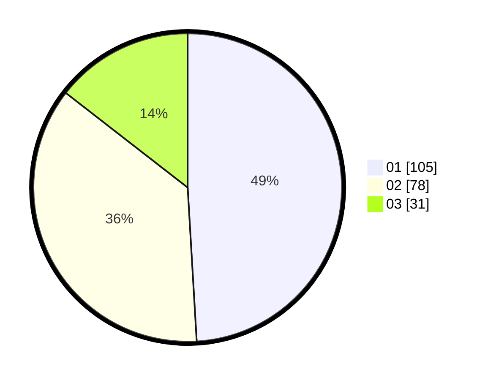

# Hasil

Hasil perolehan suara paslon dapat dilihat pada file paslon-01.txt, paslon-02.txt, dan paslon-03.txt.

Jika tidak ada, artinya data tersebut belum ada pada SIREKAP.

## Perolehan Suara

 * Paslon 01: **105**.
 * Paslon 02: **78**.
 * Paslon 03: **31**.

## Foto C Plano

https://sirekap-obj-formc.kpu.go.id/3e06/pemilu/ppwp/31/71/04/10/03/3171041003026-20240214-160055--975bcdcf-c3fe-46e8-8367-d1d0c3365717.jpg

https://sirekap-obj-formc.kpu.go.id/3e06/pemilu/ppwp/31/71/04/10/03/3171041003026-20240214-155227--828fa631-772b-40a3-a6b9-d9c54d0d4675.jpg

https://sirekap-obj-formc.kpu.go.id/3e06/pemilu/ppwp/31/71/04/10/03/3171041003026-20240214-162238--f615dd02-8d55-437d-b36b-b6cc2d6d3a2e.jpg

## DATA PEMILIH TETAP

Jumlah pemilih dalam DPT: **256**.
 * L: **127**.
 * P: **129**.

## DATA PENGGUNA HAK PILIH

Jumlah pengguna hak pilih dalam DPT: **202**.
 * L: **93**.
 * P: **109**.

Jumlah pengguna hak pilih dalam DPTb: **15**.
 * L: **5**.
 * P: **10**.

Jumlah pengguna hak pilih dalam DPK: **1**.
 * L: **1**.
 * P: **0**.

Jumlah pengguna hak pilih: **218**.
 * L: **99**.
 * P: **119**.

## JUMLAH SUARA SAH DAN TIDAK SAH

JUMLAH SELURUH SUARA SAH: **214**.

JUMLAH SUARA TIDAK SAH: **4**.

JUMLAH SELURUH SUARA SAH DAN SUARA TIDAK SAH: **218**.
