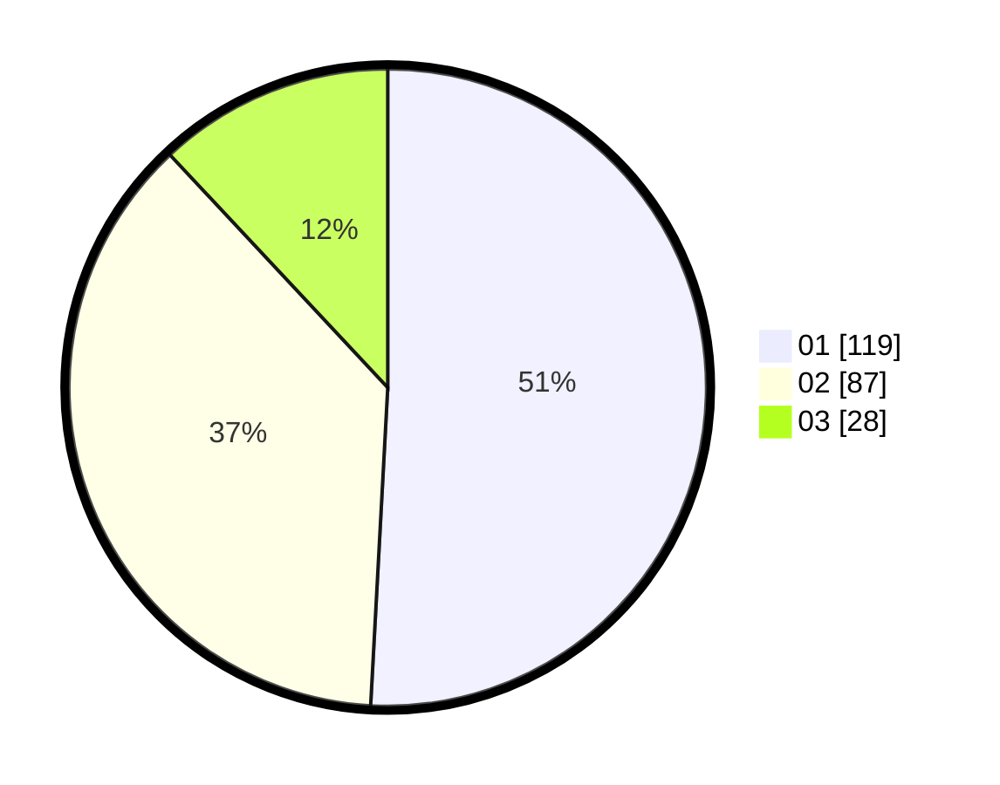

# Hasil

Hasil perolehan suara paslon dapat dilihat pada file paslon-01.txt, paslon-02.txt, dan paslon-03.txt.

Jika tidak ada, artinya data tersebut belum ada pada SIREKAP.

## Perolehan Suara

 * Paslon 01: **119**.
 * Paslon 02: **87**.
 * Paslon 03: **28**.

## Foto C Plano

https://sirekap-obj-formc.kpu.go.id/3d06/pemilu/ppwp/31/71/04/10/03/3171041003029-20240216-150019--1dce2797-df6b-4079-b9d0-d1c33c03b6a6.jpg

https://sirekap-obj-formc.kpu.go.id/3d06/pemilu/ppwp/31/71/04/10/03/3171041003029-20240214-235919--8a8b1ea1-2485-476c-91e0-0ac1ad7fa239.jpg

https://sirekap-obj-formc.kpu.go.id/3d06/pemilu/ppwp/31/71/04/10/03/3171041003029-20240216-150315--a60ca6ad-04a4-419b-bf13-a482c1ea0ec7.jpg
