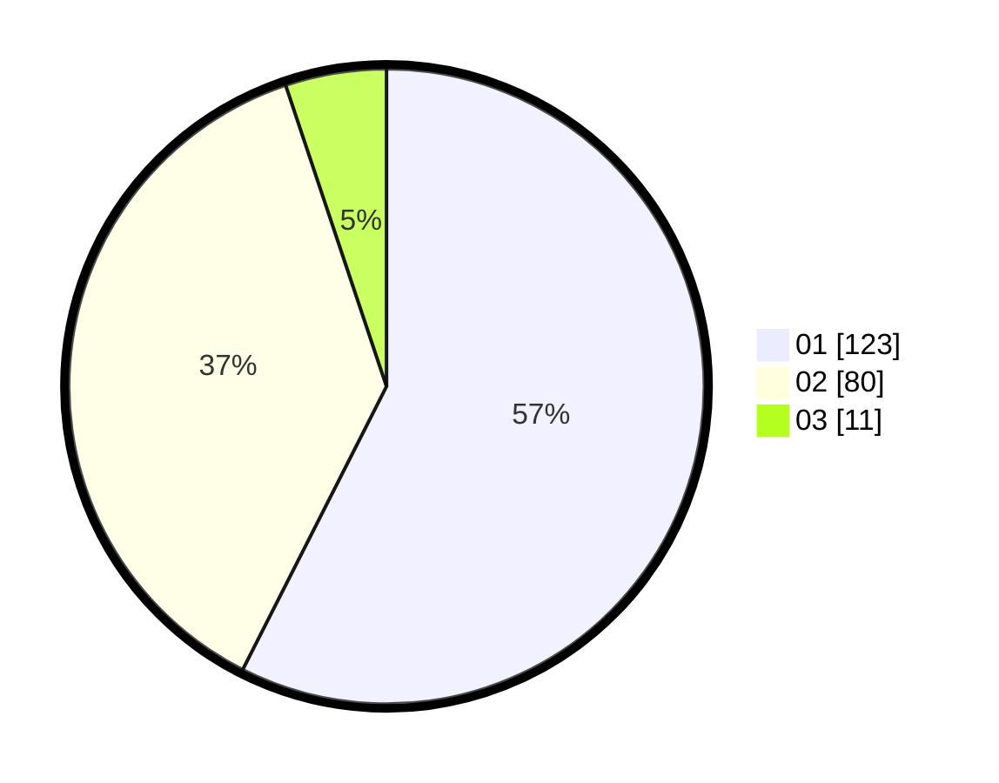

# Hasil

Hasil perolehan suara paslon dapat dilihat pada file paslon-01.txt, paslon-02.txt, dan paslon-03.txt.

Jika tidak ada, artinya data tersebut belum ada pada SIREKAP.

## Perolehan Suara

 * Paslon 01: **123**.
 * Paslon 02: **80**.
 * Paslon 03: **11**.

## Foto C Plano

https://sirekap-obj-formc.kpu.go.id/59e6/pemilu/ppwp/31/71/04/10/03/3171041003031-20240214-160118--20b8eafa-8691-4405-b74c-91811c7bd543.jpg

https://sirekap-obj-formc.kpu.go.id/59e6/pemilu/ppwp/31/71/04/10/03/3171041003031-20240214-223907--a61e44fb-ac1b-45eb-b425-75fc967047ec.jpg

https://sirekap-obj-formc.kpu.go.id/59e6/pemilu/ppwp/31/71/04/10/03/3171041003031-20240214-223921--e5ab0a79-9d4b-4b6c-8685-4126bf290d41.jpg

## DATA PEMILIH TETAP

Jumlah pemilih dalam DPT: **268**.
 * L: **128**.
 * P: **140**.

## DATA PENGGUNA HAK PILIH

Jumlah pengguna hak pilih dalam DPT: **201**.
 * L: **99**.
 * P: **102**.

Jumlah pengguna hak pilih dalam DPTb: **18**.
 * L: **9**.
 * P: **9**.

Jumlah pengguna hak pilih dalam DPK: **0**.
 * L: **0**.
 * P: **0**.

Jumlah pengguna hak pilih: **219**.
 * L: **108**.
 * P: **111**.

## JUMLAH SUARA SAH DAN TIDAK SAH

JUMLAH SELURUH SUARA SAH: **214**.

JUMLAH SUARA TIDAK SAH: **5**.

JUMLAH SELURUH SUARA SAH DAN SUARA TIDAK SAH: **219**.
