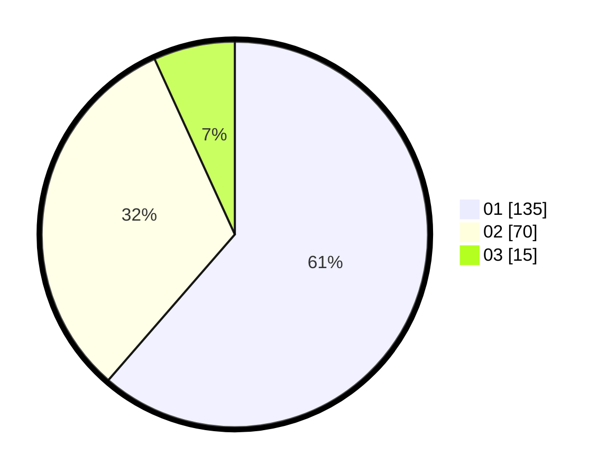

# Hasil

Hasil perolehan suara paslon dapat dilihat pada file paslon-01.txt, paslon-02.txt, dan paslon-03.txt.

Jika tidak ada, artinya data tersebut belum ada pada SIREKAP.

## Perolehan Suara

 * Paslon 01: **135**.
 * Paslon 02: **70**.
 * Paslon 03: **15**.

## Foto C Plano

https://sirekap-obj-formc.kpu.go.id/5e5c/pemilu/ppwp/31/71/04/10/03/3171041003032-20240215-010505--e09b9046-b747-4b6d-99bb-63e6c016bfa4.jpg

https://sirekap-obj-formc.kpu.go.id/5e5c/pemilu/ppwp/31/71/04/10/03/3171041003032-20240215-010625--e37ed416-8a3f-40e0-ad63-d164c2ee1272.jpg

https://sirekap-obj-formc.kpu.go.id/5e5c/pemilu/ppwp/31/71/04/10/03/3171041003032-20240215-010724--742a0b05-cb24-44ae-8160-93348478b3d9.jpg
