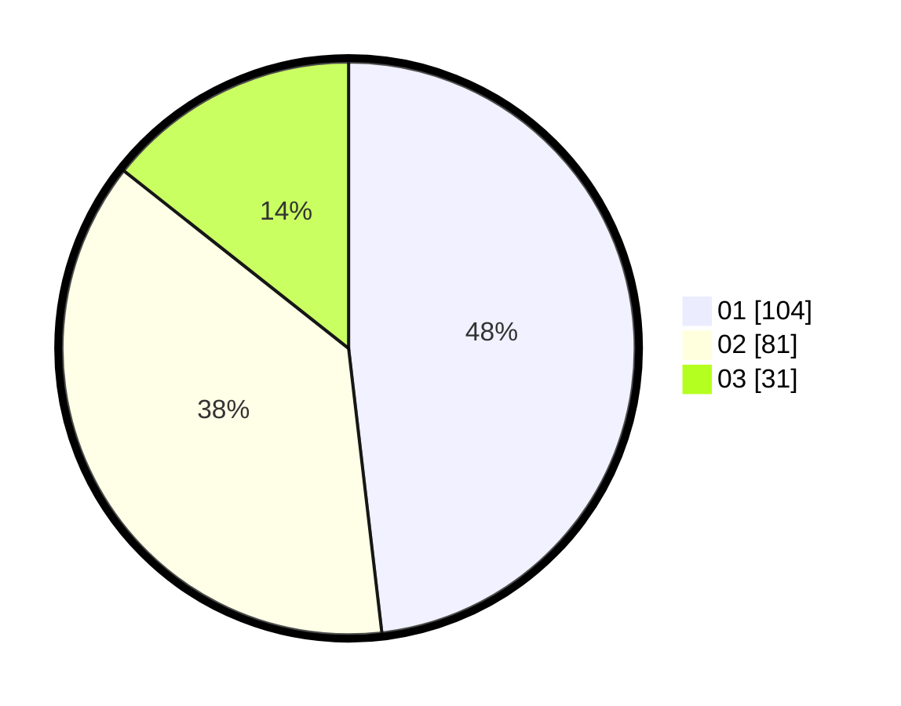

# Hasil

Hasil perolehan suara paslon dapat dilihat pada file paslon-01.txt, paslon-02.txt, dan paslon-03.txt.

Jika tidak ada, artinya data tersebut belum ada pada SIREKAP.

## Perolehan Suara

 * Paslon 01: **104**.
 * Paslon 02: **81**.
 * Paslon 03: **31**.

## Foto C Plano

https://sirekap-obj-formc.kpu.go.id/cca6/pemilu/ppwp/31/71/04/10/03/3171041003039-20240217-110441--48255caa-11c1-428b-8a3b-ca5fba3df68b.jpg

https://sirekap-obj-formc.kpu.go.id/cca6/pemilu/ppwp/31/71/04/10/03/3171041003039-20240217-101903--0fac79b5-bd96-4be1-beae-13d18223ea4c.jpg

https://sirekap-obj-formc.kpu.go.id/cca6/pemilu/ppwp/31/71/04/10/03/3171041003039-20240217-111417--aa7585d0-0a5e-496b-97a8-0d741c8c2eb2.jpg

## DATA PEMILIH TETAP

Jumlah pemilih dalam DPT: **264**.
 * L: **127**.
 * P: **137**.

## DATA PENGGUNA HAK PILIH

Jumlah pengguna hak pilih dalam DPT: **193**.
 * L: **98**.
 * P: **95**.

Jumlah pengguna hak pilih dalam DPTb: **15**.
 * L: **4**.
 * P: **11**.

Jumlah pengguna hak pilih dalam DPK: **11**.
 * L: **3**.
 * P: **8**.

Jumlah pengguna hak pilih: **219**.
 * L: **105**.
 * P: **114**.

## JUMLAH SUARA SAH DAN TIDAK SAH

JUMLAH SELURUH SUARA SAH: **216**.

JUMLAH SUARA TIDAK SAH: **3**.

JUMLAH SELURUH SUARA SAH DAN SUARA TIDAK SAH: **219**.
