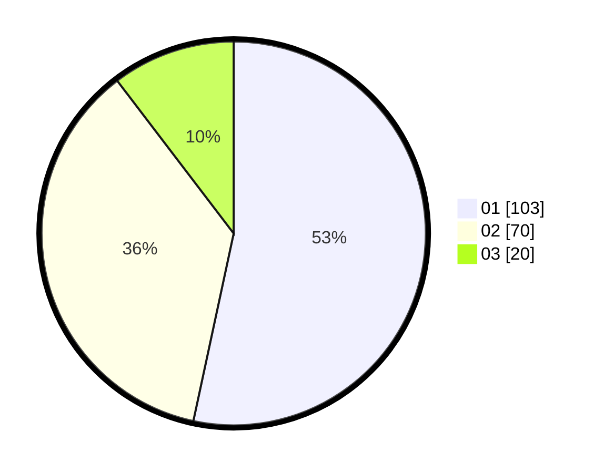

# Hasil

Hasil perolehan suara paslon dapat dilihat pada file paslon-01.txt, paslon-02.txt, dan paslon-03.txt.

Jika tidak ada, artinya data tersebut belum ada pada SIREKAP.

## Perolehan Suara

 * Paslon 01: **103**.
 * Paslon 02: **70**.
 * Paslon 03: **20**.

## Foto C Plano

https://sirekap-obj-formc.kpu.go.id/2de2/pemilu/ppwp/31/71/04/10/03/3171041003042-20240217-125751--e52cdc26-5856-4579-8dc8-033f2b0b432b.jpg

https://sirekap-obj-formc.kpu.go.id/2de2/pemilu/ppwp/31/71/04/10/03/3171041003042-20240217-131514--9f3821ca-1609-4300-9f95-d8afd34671bf.jpg
