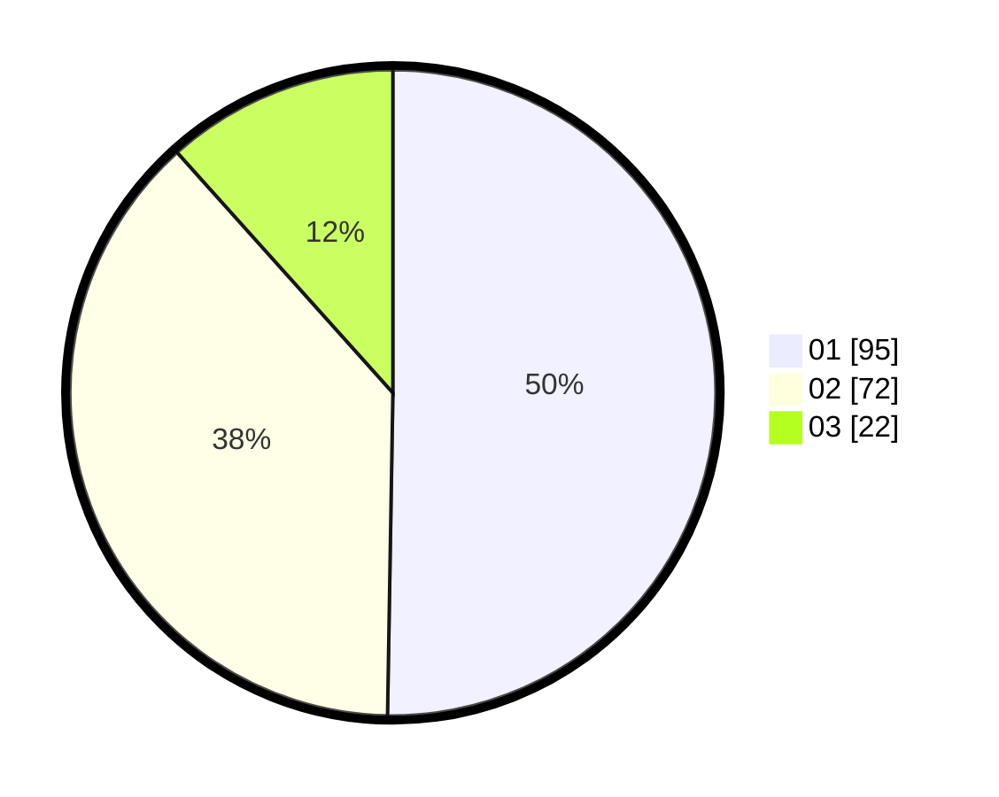

# Hasil

Hasil perolehan suara paslon dapat dilihat pada file paslon-01.txt, paslon-02.txt, dan paslon-03.txt.

Jika tidak ada, artinya data tersebut belum ada pada SIREKAP.

## Perolehan Suara

 * Paslon 01: **95**.
 * Paslon 02: **72**.
 * Paslon 03: **22**.

## Foto C Plano

https://sirekap-obj-formc.kpu.go.id/de80/pemilu/ppwp/31/71/04/10/03/3171041003045-20240217-205053--8e972fe1-b06a-4b61-a178-e7820adaf7a4.jpg

https://sirekap-obj-formc.kpu.go.id/de80/pemilu/ppwp/31/71/04/10/03/3171041003045-20240217-210945--1d31428b-a581-4598-8977-e23f33022654.jpg

https://sirekap-obj-formc.kpu.go.id/de80/pemilu/ppwp/31/71/04/10/03/3171041003045-20240214-155924--162eecd7-843d-4e74-afd9-9d22842d808a.jpg

## DATA PEMILIH TETAP

Jumlah pemilih dalam DPT: **257**.
 * L: **124**.
 * P: **133**.

## DATA PENGGUNA HAK PILIH

Jumlah pengguna hak pilih dalam DPT: **180**.
 * L: **87**.
 * P: **93**.

Jumlah pengguna hak pilih dalam DPTb: **11**.
 * L: **0**.
 * P: **11**.

Jumlah pengguna hak pilih dalam DPK: **1**.
 * L: **0**.
 * P: **1**.

Jumlah pengguna hak pilih: **192**.
 * L: **87**.
 * P: **105**.

## JUMLAH SUARA SAH DAN TIDAK SAH

JUMLAH SELURUH SUARA SAH: **189**.

JUMLAH SUARA TIDAK SAH: **3**.

JUMLAH SELURUH SUARA SAH DAN SUARA TIDAK SAH: **192**.
