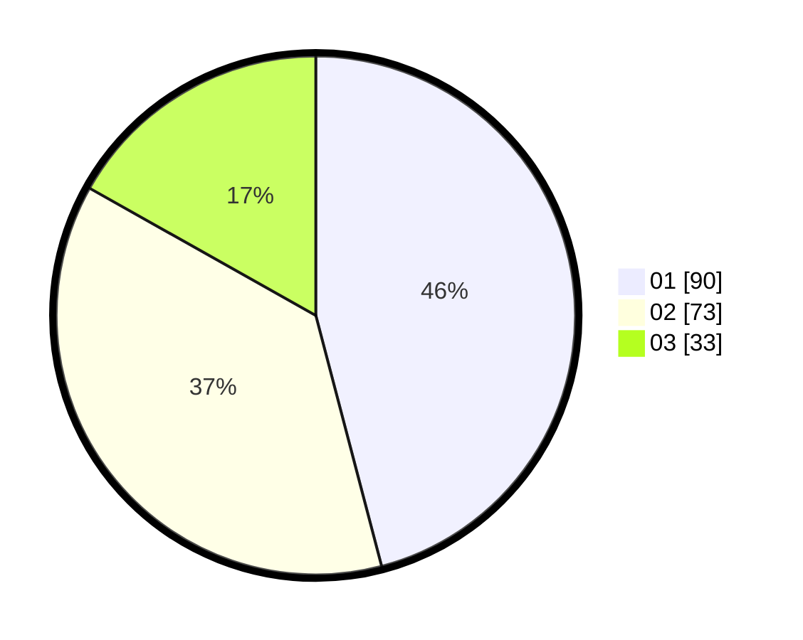

# Hasil

Hasil perolehan suara paslon dapat dilihat pada file paslon-01.txt, paslon-02.txt, dan paslon-03.txt.

Jika tidak ada, artinya data tersebut belum ada pada SIREKAP.

## Perolehan Suara

 * Paslon 01: **90**.
 * Paslon 02: **73**.
 * Paslon 03: **33**.

## Foto C Plano

https://sirekap-obj-formc.kpu.go.id/c595/pemilu/ppwp/31/71/04/10/03/3171041003046-20240216-203212--8741020b-876f-4523-ba55-97a32546267b.jpg

https://sirekap-obj-formc.kpu.go.id/c595/pemilu/ppwp/31/71/04/10/03/3171041003046-20240216-203831--0e33130a-a11d-4db5-a933-4f89ec09769c.jpg

https://sirekap-obj-formc.kpu.go.id/c595/pemilu/ppwp/31/71/04/10/03/3171041003046-20240216-204553--4ee4f9c2-32bb-45d3-aca8-b77722a7f451.jpg

## DATA PEMILIH TETAP

Jumlah pemilih dalam DPT: **247**.
 * L: **117**.
 * P: **130**.

## DATA PENGGUNA HAK PILIH

Jumlah pengguna hak pilih dalam DPT: **177**.
 * L: **81**.
 * P: **96**.

Jumlah pengguna hak pilih dalam DPTb: **17**.
 * L: **2**.
 * P: **15**.

Jumlah pengguna hak pilih dalam DPK: **3**.
 * L: **2**.
 * P: **1**.

Jumlah pengguna hak pilih: **197**.
 * L: **85**.
 * P: **112**.

## JUMLAH SUARA SAH DAN TIDAK SAH

JUMLAH SELURUH SUARA SAH: **196**.

JUMLAH SUARA TIDAK SAH: **1**.

JUMLAH SELURUH SUARA SAH DAN SUARA TIDAK SAH: **197**.
