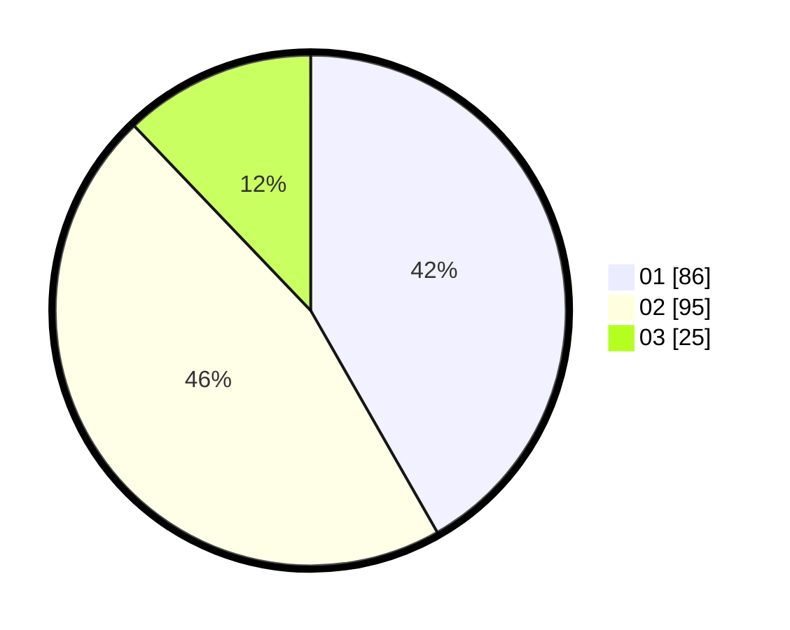

# Hasil

Hasil perolehan suara paslon dapat dilihat pada file paslon-01.txt, paslon-02.txt, dan paslon-03.txt.

Jika tidak ada, artinya data tersebut belum ada pada SIREKAP.

## Perolehan Suara

 * Paslon 01: **86**.
 * Paslon 02: **95**.
 * Paslon 03: **25**.

## Foto C Plano

https://sirekap-obj-formc.kpu.go.id/78fb/pemilu/ppwp/31/71/04/10/03/3171041003047-20240217-123734--c816f8ef-cc51-4832-8c20-69c766e570d2.jpg

https://sirekap-obj-formc.kpu.go.id/78fb/pemilu/ppwp/31/71/04/10/03/3171041003047-20240217-124033--5317c2e0-4ec1-401e-b6e7-889f97dac81b.jpg
