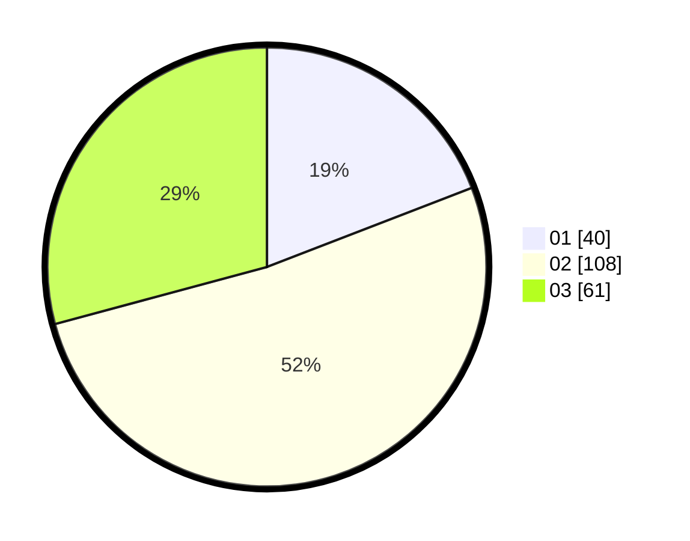

# Hasil

Hasil perolehan suara paslon dapat dilihat pada file paslon-01.txt, paslon-02.txt, dan paslon-03.txt.

Jika tidak ada, artinya data tersebut belum ada pada SIREKAP.

## Perolehan Suara

 * Paslon 01: **40**.
 * Paslon 02: **108**.
 * Paslon 03: **61**.

## Foto C Plano

https://sirekap-obj-formc.kpu.go.id/9c67/pemilu/ppwp/31/71/04/10/03/3171041003048-20240216-231350--8e875021-a578-4a8c-9a20-9af2788b4555.jpg

https://sirekap-obj-formc.kpu.go.id/9c67/pemilu/ppwp/31/71/04/10/03/3171041003048-20240216-231351--8e7e7da9-1e67-4cac-98ec-ebabeea3020e.jpg

https://sirekap-obj-formc.kpu.go.id/9c67/pemilu/ppwp/31/71/04/10/03/3171041003048-20240216-231350--355ee8f4-5f4a-4311-b3a9-8b6b72f28bad.jpg

## DATA PEMILIH TETAP

Jumlah pemilih dalam DPT: **257**.
 * L: **104**.
 * P: **153**.

## DATA PENGGUNA HAK PILIH

Jumlah pengguna hak pilih dalam DPT: **179**.
 * L: **84**.
 * P: **95**.

Jumlah pengguna hak pilih dalam DPTb: **29**.
 * L: **8**.
 * P: **21**.

Jumlah pengguna hak pilih dalam DPK: **2**.
 * L: **2**.
 * P: **0**.

Jumlah pengguna hak pilih: **210**.
 * L: **94**.
 * P: **116**.

## JUMLAH SUARA SAH DAN TIDAK SAH

JUMLAH SELURUH SUARA SAH: **209**.

JUMLAH SUARA TIDAK SAH: **1**.

JUMLAH SELURUH SUARA SAH DAN SUARA TIDAK SAH: **210**.
