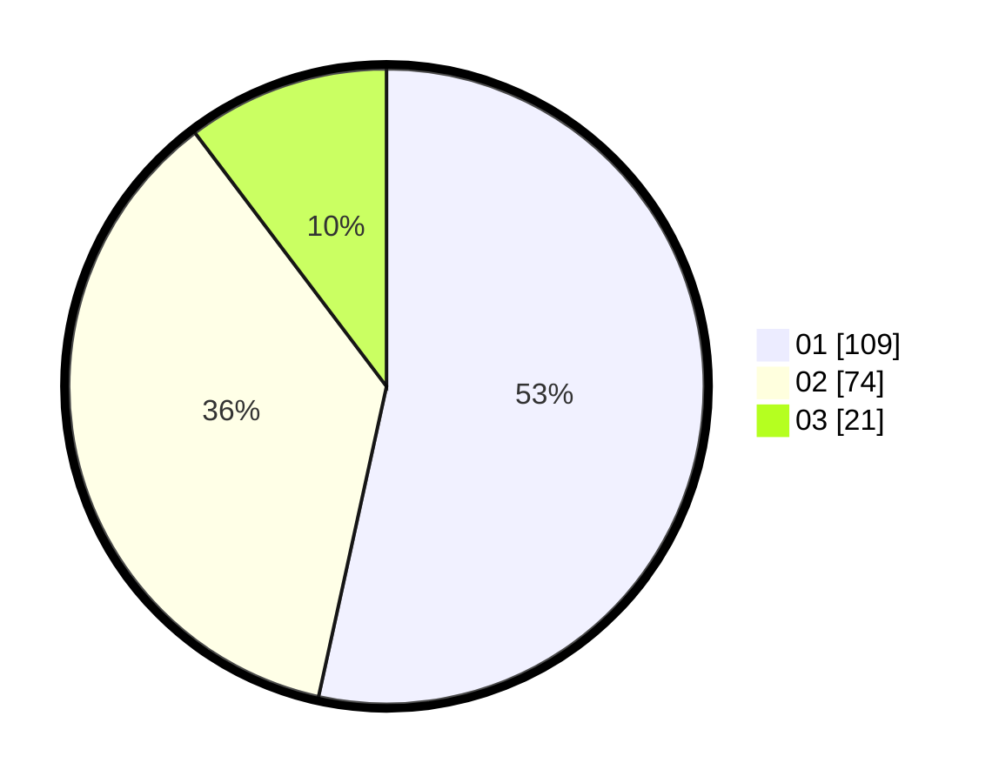

# Hasil

Hasil perolehan suara paslon dapat dilihat pada file paslon-01.txt, paslon-02.txt, dan paslon-03.txt.

Jika tidak ada, artinya data tersebut belum ada pada SIREKAP.

## Perolehan Suara

 * Paslon 01: **109**.
 * Paslon 02: **74**.
 * Paslon 03: **21**.

## Foto C Plano

https://sirekap-obj-formc.kpu.go.id/0194/pemilu/ppwp/31/71/04/10/03/3171041003053-20240215-005501--11629940-4e67-4aa4-be33-cf094fb532d6.jpg

https://sirekap-obj-formc.kpu.go.id/0194/pemilu/ppwp/31/71/04/10/03/3171041003053-20240215-005630--9214ba65-1e5c-4f77-a051-a01ca96566f7.jpg

https://sirekap-obj-formc.kpu.go.id/0194/pemilu/ppwp/31/71/04/10/03/3171041003053-20240215-005734--d1e29463-cf62-4547-bc2d-64a61fdb5b0e.jpg

## DATA PEMILIH TETAP

Jumlah pemilih dalam DPT: **258**.
 * L: **138**.
 * P: **120**.

## DATA PENGGUNA HAK PILIH

Jumlah pengguna hak pilih dalam DPT: **187**.
 * L: **100**.
 * P: **87**.

Jumlah pengguna hak pilih dalam DPTb: **19**.
 * L: **3**.
 * P: **16**.

Jumlah pengguna hak pilih dalam DPK: **2**.
 * L: **1**.
 * P: **1**.

Jumlah pengguna hak pilih: **208**.
 * L: **104**.
 * P: **104**.

## JUMLAH SUARA SAH DAN TIDAK SAH

JUMLAH SELURUH SUARA SAH: **204**.

JUMLAH SUARA TIDAK SAH: **4**.

JUMLAH SELURUH SUARA SAH DAN SUARA TIDAK SAH: **208**.
