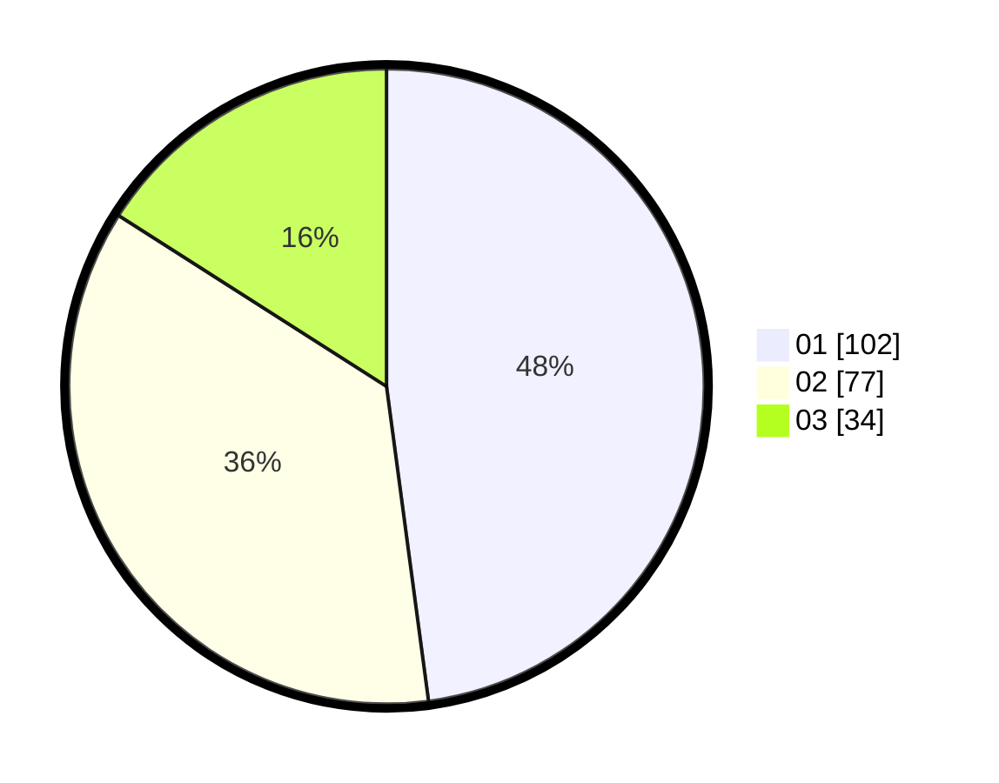

# Hasil

Hasil perolehan suara paslon dapat dilihat pada file paslon-01.txt, paslon-02.txt, dan paslon-03.txt.

Jika tidak ada, artinya data tersebut belum ada pada SIREKAP.

## Perolehan Suara

 * Paslon 01: **102**.
 * Paslon 02: **77**.
 * Paslon 03: **34**.

## Foto C Plano

https://sirekap-obj-formc.kpu.go.id/1c60/pemilu/ppwp/31/71/04/10/03/3171041003054-20240214-155536--40466f06-6a2e-4af3-8779-ecdb5393a494.jpg

https://sirekap-obj-formc.kpu.go.id/1c60/pemilu/ppwp/31/71/04/10/03/3171041003054-20240214-155306--ed4a3120-3d4d-480f-b6c3-e23a15080d9c.jpg
