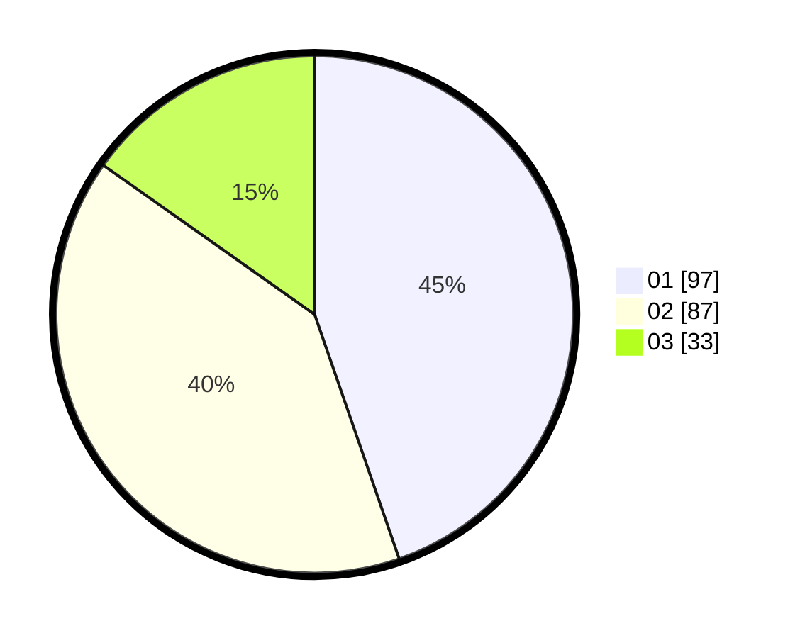

# Hasil

Hasil perolehan suara paslon dapat dilihat pada file paslon-01.txt, paslon-02.txt, dan paslon-03.txt.

Jika tidak ada, artinya data tersebut belum ada pada SIREKAP.

## Perolehan Suara

 * Paslon 01: **97**.
 * Paslon 02: **87**.
 * Paslon 03: **33**.

## Foto C Plano

https://sirekap-obj-formc.kpu.go.id/94b0/pemilu/ppwp/31/71/04/10/03/3171041003058-20240215-001317--ec9cca06-0f61-4eec-b48c-fc129ecc00d1.jpg

https://sirekap-obj-formc.kpu.go.id/94b0/pemilu/ppwp/31/71/04/10/03/3171041003058-20240215-001458--ac01873e-3158-4213-8411-3e75da07d06c.jpg

https://sirekap-obj-formc.kpu.go.id/94b0/pemilu/ppwp/31/71/04/10/03/3171041003058-20240215-001607--436f463d-95af-45a4-9c63-2936ec24e727.jpg

## DATA PEMILIH TETAP

Jumlah pemilih dalam DPT: **248**.
 * L: **119**.
 * P: **129**.

## DATA PENGGUNA HAK PILIH

Jumlah pengguna hak pilih dalam DPT: **204**.
 * L: **95**.
 * P: **109**.

Jumlah pengguna hak pilih dalam DPTb: **14**.
 * L: **5**.
 * P: **9**.

Jumlah pengguna hak pilih dalam DPK: **0**.
 * L: **0**.
 * P: **0**.

Jumlah pengguna hak pilih: **218**.
 * L: **100**.
 * P: **118**.

## JUMLAH SUARA SAH DAN TIDAK SAH

JUMLAH SELURUH SUARA SAH: **217**.

JUMLAH SUARA TIDAK SAH: **1**.

JUMLAH SELURUH SUARA SAH DAN SUARA TIDAK SAH: **218**.
