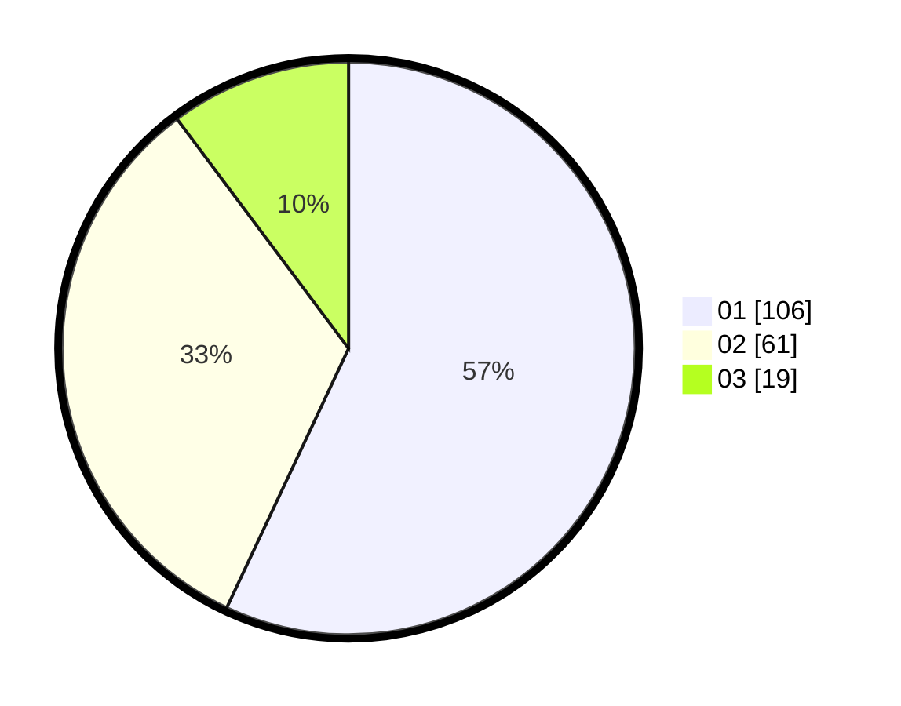

# Hasil

Hasil perolehan suara paslon dapat dilihat pada file paslon-01.txt, paslon-02.txt, dan paslon-03.txt.

Jika tidak ada, artinya data tersebut belum ada pada SIREKAP.

## Perolehan Suara

 * Paslon 01: **106**.
 * Paslon 02: **61**.
 * Paslon 03: **19**.

## Foto C Plano

https://sirekap-obj-formc.kpu.go.id/ff0a/pemilu/ppwp/31/71/04/10/03/3171041003062-20240215-151402--12369413-52d7-4eaf-b78f-2fa9d22fc491.jpg

https://sirekap-obj-formc.kpu.go.id/ff0a/pemilu/ppwp/31/71/04/10/03/3171041003062-20240216-171231--2087d94d-2604-426a-bfeb-b2598c016cdb.jpg

https://sirekap-obj-formc.kpu.go.id/ff0a/pemilu/ppwp/31/71/04/10/03/3171041003062-20240215-151509--c3ac278c-c847-447c-b306-14a1d2a0545f.jpg

## DATA PEMILIH TETAP

Jumlah pemilih dalam DPT: **252**.
 * L: **125**.
 * P: **127**.

## DATA PENGGUNA HAK PILIH

Jumlah pengguna hak pilih dalam DPT: **183**.
 * L: **88**.
 * P: **95**.

Jumlah pengguna hak pilih dalam DPTb: **2**.
 * L: **1**.
 * P: **1**.

Jumlah pengguna hak pilih dalam DPK: **1**.
 * L: **1**.
 * P: **0**.

Jumlah pengguna hak pilih: **186**.
 * L: **90**.
 * P: **96**.

## JUMLAH SUARA SAH DAN TIDAK SAH

JUMLAH SELURUH SUARA SAH: **186**.

JUMLAH SUARA TIDAK SAH: **0**.

JUMLAH SELURUH SUARA SAH DAN SUARA TIDAK SAH: **186**.
