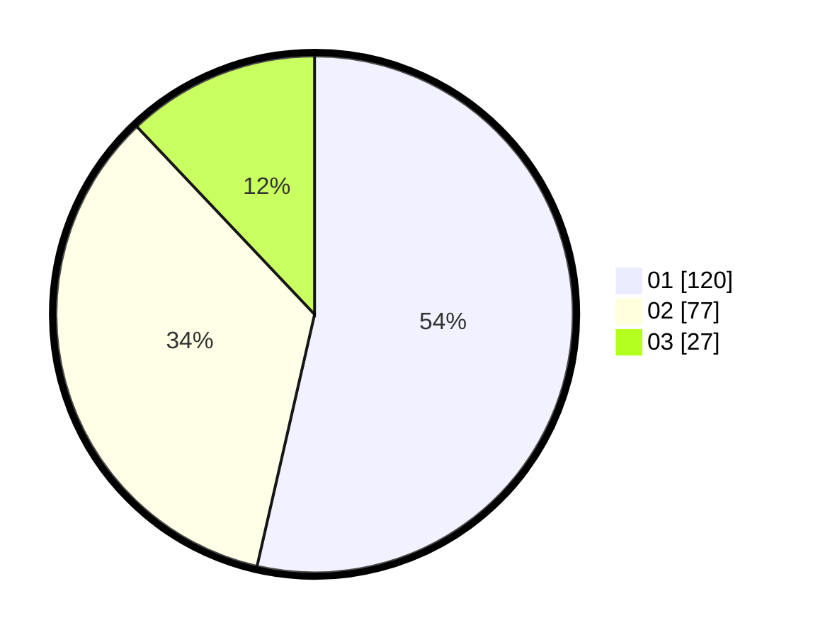

# Hasil

Hasil perolehan suara paslon dapat dilihat pada file paslon-01.txt, paslon-02.txt, dan paslon-03.txt.

Jika tidak ada, artinya data tersebut belum ada pada SIREKAP.

## Perolehan Suara

 * Paslon 01: **120**.
 * Paslon 02: **77**.
 * Paslon 03: **27**.

## Foto C Plano

https://sirekap-obj-formc.kpu.go.id/32ef/pemilu/ppwp/31/71/04/10/03/3171041003075-20240214-231242--786432cb-b062-4c47-a814-56a5b9db2568.jpg

https://sirekap-obj-formc.kpu.go.id/32ef/pemilu/ppwp/31/71/04/10/03/3171041003075-20240214-231352--fac2a0b1-ce64-4b8d-a362-3d591ce45b0a.jpg

https://sirekap-obj-formc.kpu.go.id/32ef/pemilu/ppwp/31/71/04/10/03/3171041003075-20240214-231447--8886a714-bd38-4f31-a44a-6241fd9a5e09.jpg
