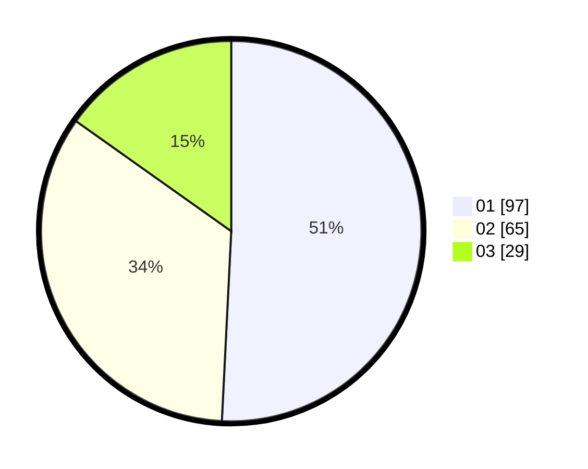

# Hasil

Hasil perolehan suara paslon dapat dilihat pada file paslon-01.txt, paslon-02.txt, dan paslon-03.txt.

Jika tidak ada, artinya data tersebut belum ada pada SIREKAP.

## Perolehan Suara

 * Paslon 01: **97**.
 * Paslon 02: **65**.
 * Paslon 03: **29**.

## Foto C Plano

https://sirekap-obj-formc.kpu.go.id/6159/pemilu/ppwp/31/71/04/10/03/3171041003076-20240214-155840--4d490400-7364-4c0e-9ea3-19c76a0833e8.jpg

https://sirekap-obj-formc.kpu.go.id/6159/pemilu/ppwp/31/71/04/10/03/3171041003076-20240214-155908--d3b9d9ef-65f0-4efa-8ce1-17d07a4ab388.jpg
