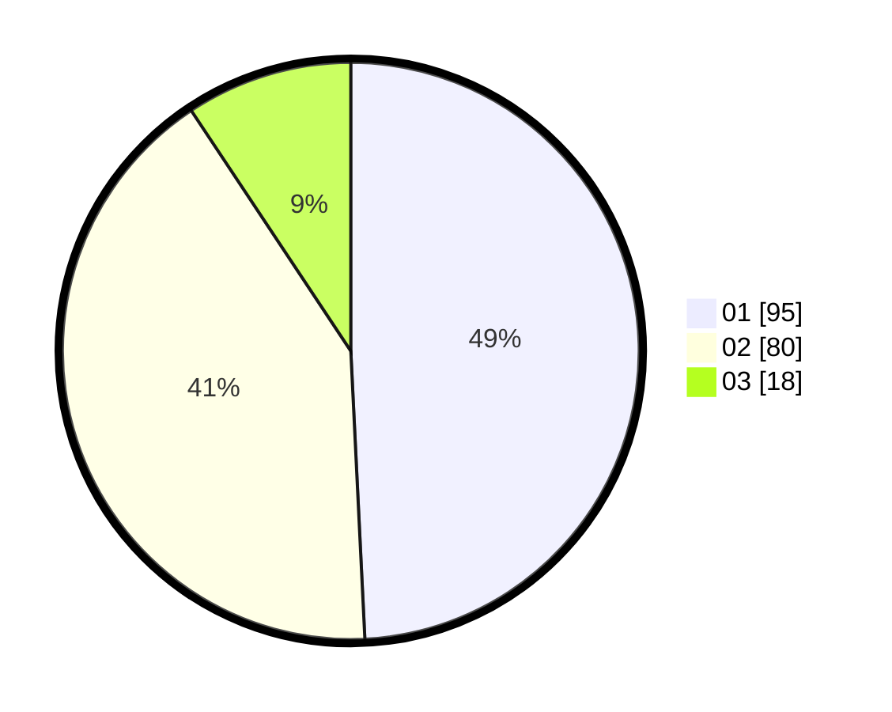

# Hasil

Hasil perolehan suara paslon dapat dilihat pada file paslon-01.txt, paslon-02.txt, dan paslon-03.txt.

Jika tidak ada, artinya data tersebut belum ada pada SIREKAP.

## Perolehan Suara

 * Paslon 01: **95**.
 * Paslon 02: **80**.
 * Paslon 03: **18**.

## Foto C Plano

https://sirekap-obj-formc.kpu.go.id/c7a6/pemilu/ppwp/31/71/04/10/03/3171041003077-20240214-185710--89729258-ab35-46d5-b61d-c59c96c00f7e.jpg

https://sirekap-obj-formc.kpu.go.id/c7a6/pemilu/ppwp/31/71/04/10/03/3171041003077-20240217-071937--e6544b7f-56fb-4809-8917-b9672dbaf015.jpg

https://sirekap-obj-formc.kpu.go.id/c7a6/pemilu/ppwp/31/71/04/10/03/3171041003077-20240217-071946--c42afd01-e016-4772-8420-c8439024ec92.jpg
