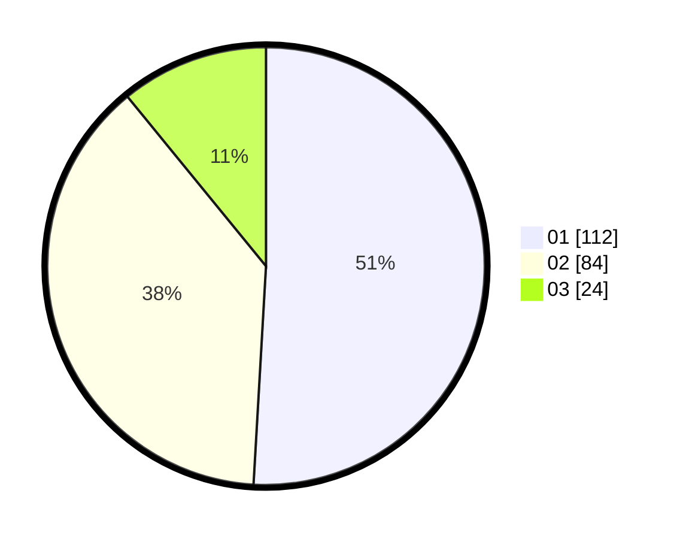

# Hasil

Hasil perolehan suara paslon dapat dilihat pada file paslon-01.txt, paslon-02.txt, dan paslon-03.txt.

Jika tidak ada, artinya data tersebut belum ada pada SIREKAP.

## Perolehan Suara

 * Paslon 01: **112**.
 * Paslon 02: **84**.
 * Paslon 03: **24**.

## Foto C Plano

https://sirekap-obj-formc.kpu.go.id/d940/pemilu/ppwp/31/71/04/10/03/3171041003081-20240215-034328--c60a8b20-363c-4b8e-aa42-cc50df14e2fb.jpg

https://sirekap-obj-formc.kpu.go.id/d940/pemilu/ppwp/31/71/04/10/03/3171041003081-20240215-034435--a7b828de-9439-4cb7-bb78-0415ae885dea.jpg

https://sirekap-obj-formc.kpu.go.id/d940/pemilu/ppwp/31/71/04/10/03/3171041003081-20240215-034533--17d42029-4a55-4036-85df-4d8e2a8f0218.jpg

## DATA PEMILIH TETAP

Jumlah pemilih dalam DPT: **254**.
 * L: **129**.
 * P: **125**.

## DATA PENGGUNA HAK PILIH

Jumlah pengguna hak pilih dalam DPT: **212**.
 * L: **107**.
 * P: **105**.

Jumlah pengguna hak pilih dalam DPTb: **11**.
 * L: **6**.
 * P: **5**.

Jumlah pengguna hak pilih dalam DPK: **0**.
 * L: **0**.
 * P: **0**.

Jumlah pengguna hak pilih: **223**.
 * L: **113**.
 * P: **110**.

## JUMLAH SUARA SAH DAN TIDAK SAH
