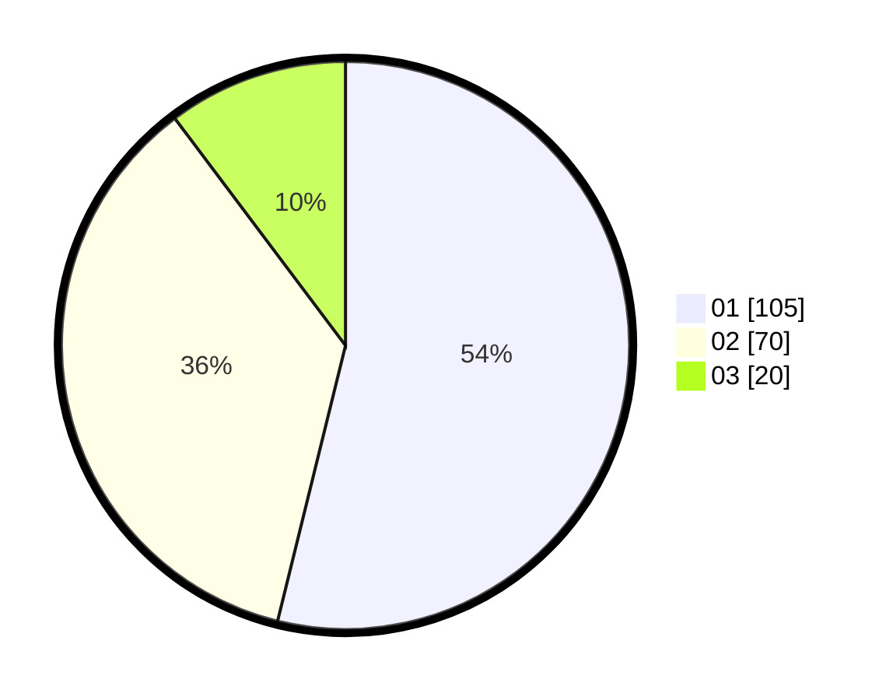

# Hasil

Hasil perolehan suara paslon dapat dilihat pada file paslon-01.txt, paslon-02.txt, dan paslon-03.txt.

Jika tidak ada, artinya data tersebut belum ada pada SIREKAP.

## Perolehan Suara

 * Paslon 01: **105**.
 * Paslon 02: **70**.
 * Paslon 03: **20**.

## Foto C Plano

https://sirekap-obj-formc.kpu.go.id/a885/pemilu/ppwp/31/71/04/10/03/3171041003082-20240217-213408--64ed91e6-ce01-4b02-80dd-60fc5f34d8a2.jpg

https://sirekap-obj-formc.kpu.go.id/a885/pemilu/ppwp/31/71/04/10/03/3171041003082-20240217-221550--d6d2b5bf-8160-4e08-b4eb-dd219f427cf9.jpg

https://sirekap-obj-formc.kpu.go.id/a885/pemilu/ppwp/31/71/04/10/03/3171041003082-20240217-214200--d14081b1-6e36-42dd-bf54-d1763dc919cf.jpg

## DATA PEMILIH TETAP

Jumlah pemilih dalam DPT: **247**.
 * L: **119**.
 * P: **128**.

## DATA PENGGUNA HAK PILIH

Jumlah pengguna hak pilih dalam DPT: **188**.
 * L: **85**.
 * P: **103**.

Jumlah pengguna hak pilih dalam DPTb: **9**.
 * L: **2**.
 * P: **7**.

Jumlah pengguna hak pilih dalam DPK: **1**.
 * L: **0**.
 * P: **1**.

Jumlah pengguna hak pilih: **198**.
 * L: **87**.
 * P: **111**.

## JUMLAH SUARA SAH DAN TIDAK SAH

JUMLAH SELURUH SUARA SAH: **195**.

JUMLAH SUARA TIDAK SAH: **3**.

JUMLAH SELURUH SUARA SAH DAN SUARA TIDAK SAH: **198**.
