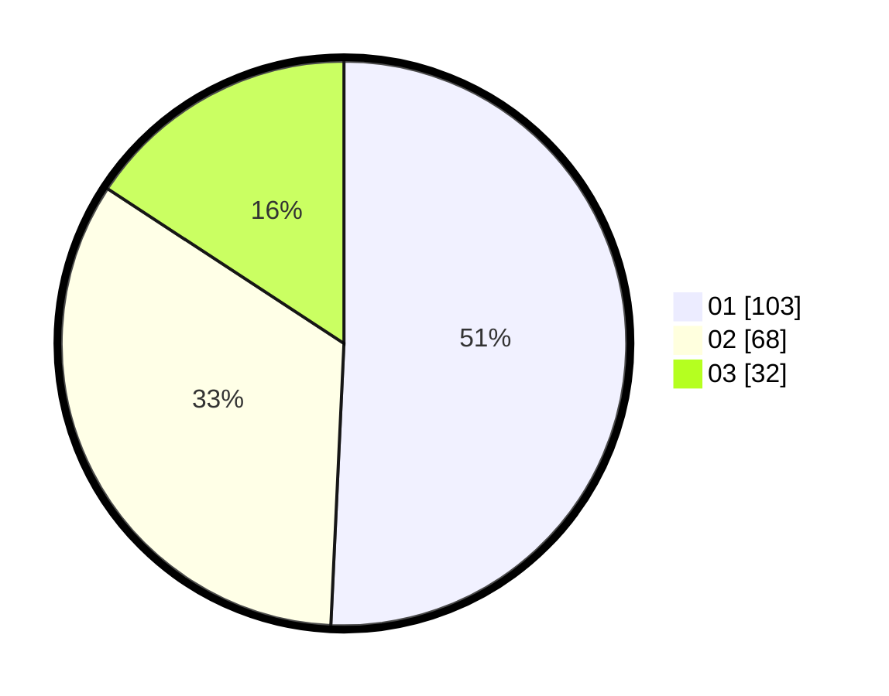

# Hasil

Hasil perolehan suara paslon dapat dilihat pada file paslon-01.txt, paslon-02.txt, dan paslon-03.txt.

Jika tidak ada, artinya data tersebut belum ada pada SIREKAP.

## Perolehan Suara

 * Paslon 01: **103**.
 * Paslon 02: **68**.
 * Paslon 03: **32**.

## Foto C Plano

https://sirekap-obj-formc.kpu.go.id/6866/pemilu/ppwp/31/71/04/10/03/3171041003083-20240214-194458--43eeb4b3-bbd0-406f-9b7f-17ba4bbbddc9.jpg

https://sirekap-obj-formc.kpu.go.id/6866/pemilu/ppwp/31/71/04/10/03/3171041003083-20240216-090921--f38e2ebd-15ce-4e17-b9ce-32678413adf2.jpg

https://sirekap-obj-formc.kpu.go.id/6866/pemilu/ppwp/31/71/04/10/03/3171041003083-20240216-090920--d8d04ec2-9f22-4bb4-bcb7-0fac22801e53.jpg

## DATA PEMILIH TETAP

Jumlah pemilih dalam DPT: **253**.
 * L: **121**.
 * P: **132**.

## DATA PENGGUNA HAK PILIH

Jumlah pengguna hak pilih dalam DPT: **194**.
 * L: **89**.
 * P: **105**.

Jumlah pengguna hak pilih dalam DPTb: **10**.
 * L: **4**.
 * P: **6**.

Jumlah pengguna hak pilih dalam DPK: **0**.
 * L: **0**.
 * P: **0**.

Jumlah pengguna hak pilih: **204**.
 * L: **93**.
 * P: **111**.

## JUMLAH SUARA SAH DAN TIDAK SAH

JUMLAH SELURUH SUARA SAH: **203**.

JUMLAH SUARA TIDAK SAH: **1**.

JUMLAH SELURUH SUARA SAH DAN SUARA TIDAK SAH: **204**.
