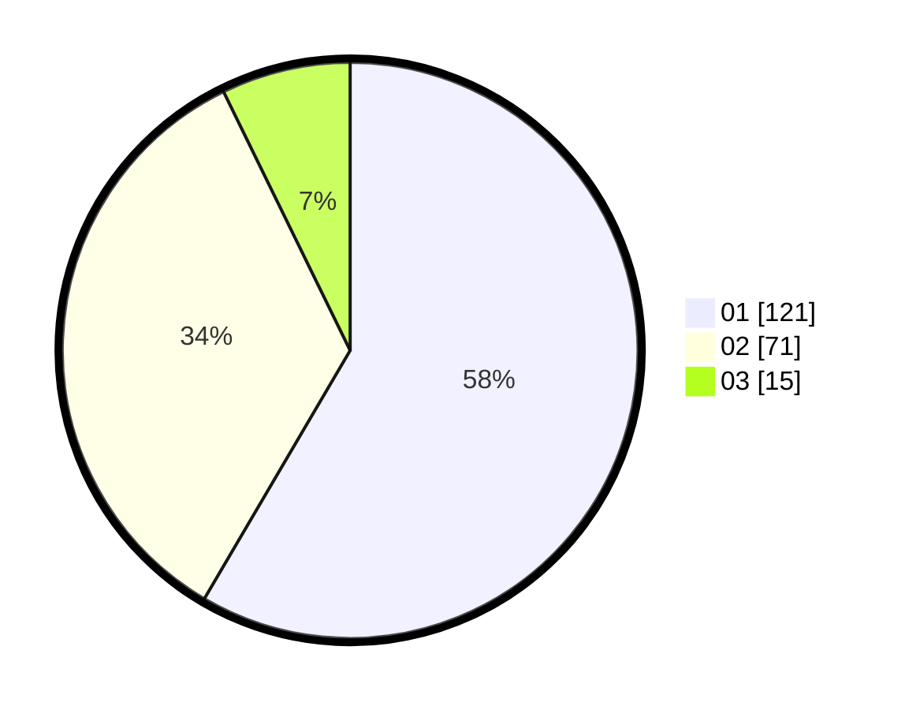

# Hasil

Hasil perolehan suara paslon dapat dilihat pada file paslon-01.txt, paslon-02.txt, dan paslon-03.txt.

Jika tidak ada, artinya data tersebut belum ada pada SIREKAP.

## Perolehan Suara

 * Paslon 01: **121**.
 * Paslon 02: **71**.
 * Paslon 03: **15**.

## Foto C Plano

https://sirekap-obj-formc.kpu.go.id/5574/pemilu/ppwp/31/71/04/10/04/3171041004002-20240215-184642--21ba20dd-10ee-4702-a03e-8b77bd4ff2af.jpg

https://sirekap-obj-formc.kpu.go.id/5574/pemilu/ppwp/31/71/04/10/04/3171041004002-20240214-185257--65c2e726-ea7a-4515-8db0-632f39ba4839.jpg

https://sirekap-obj-formc.kpu.go.id/5574/pemilu/ppwp/31/71/04/10/04/3171041004002-20240214-193521--44b09a62-36d3-4f1f-9cf5-6051bbb586a2.jpg

## DATA PEMILIH TETAP

Jumlah pemilih dalam DPT: **206**.
 * L: **116**.
 * P: **90**.

## DATA PENGGUNA HAK PILIH

Jumlah pengguna hak pilih dalam DPT: **202**.
 * L: **113**.
 * P: **89**.

Jumlah pengguna hak pilih dalam DPTb: **6**.
 * L: **4**.
 * P: **2**.

Jumlah pengguna hak pilih dalam DPK: **4**.
 * L: **2**.
 * P: **2**.

Jumlah pengguna hak pilih: **212**.
 * L: **119**.
 * P: **93**.

## JUMLAH SUARA SAH DAN TIDAK SAH

JUMLAH SELURUH SUARA SAH: **207**.

JUMLAH SUARA TIDAK SAH: **5**.

JUMLAH SELURUH SUARA SAH DAN SUARA TIDAK SAH: **212**.
