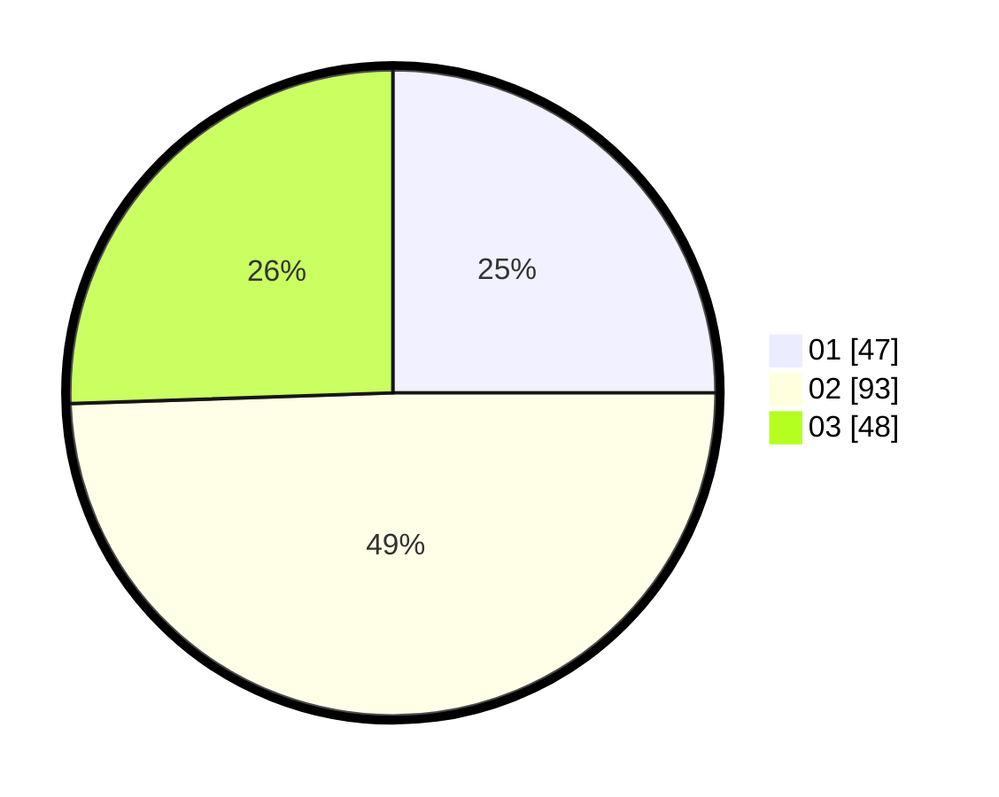

# Hasil

Hasil perolehan suara paslon dapat dilihat pada file paslon-01.txt, paslon-02.txt, dan paslon-03.txt.

Jika tidak ada, artinya data tersebut belum ada pada SIREKAP.

## Perolehan Suara

 * Paslon 01: **47**.
 * Paslon 02: **93**.
 * Paslon 03: **48**.

## Foto C Plano

https://sirekap-obj-formc.kpu.go.id/f079/pemilu/ppwp/31/71/04/10/04/3171041004016-20240216-135407--30e6dc46-5fd7-4956-999a-08e59828b5f2.jpg

https://sirekap-obj-formc.kpu.go.id/f079/pemilu/ppwp/31/71/04/10/04/3171041004016-20240216-135408--c55fcd18-9dd7-4f22-8aed-47f4f2bd5ff8.jpg

https://sirekap-obj-formc.kpu.go.id/f079/pemilu/ppwp/31/71/04/10/04/3171041004016-20240216-135408--aa06eb06-971a-4752-92ff-ded1ff0caf6a.jpg

## DATA PEMILIH TETAP

Jumlah pemilih dalam DPT: **279**.
 * L: **135**.
 * P: **144**.

## DATA PENGGUNA HAK PILIH

Jumlah pengguna hak pilih dalam DPT: **176**.
 * L: **74**.
 * P: **102**.

Jumlah pengguna hak pilih dalam DPTb: **13**.
 * L: **5**.
 * P: **8**.

Jumlah pengguna hak pilih dalam DPK: **0**.
 * L: **0**.
 * P: **0**.

Jumlah pengguna hak pilih: **189**.
 * L: **79**.
 * P: **110**.

## JUMLAH SUARA SAH DAN TIDAK SAH

JUMLAH SELURUH SUARA SAH: **188**.

JUMLAH SUARA TIDAK SAH: **1**.

JUMLAH SELURUH SUARA SAH DAN SUARA TIDAK SAH: **189**.
