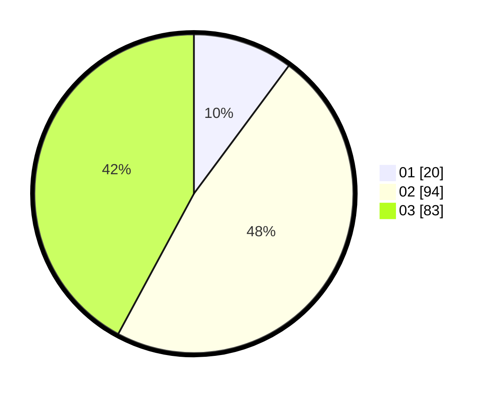

# Hasil

Hasil perolehan suara paslon dapat dilihat pada file paslon-01.txt, paslon-02.txt, dan paslon-03.txt.

Jika tidak ada, artinya data tersebut belum ada pada SIREKAP.

## Perolehan Suara

 * Paslon 01: **20**.
 * Paslon 02: **94**.
 * Paslon 03: **83**.

## Foto C Plano

https://sirekap-obj-formc.kpu.go.id/7de5/pemilu/ppwp/31/71/04/10/04/3171041004017-20240215-001812--11f014e0-2e66-47ec-ab1d-c905f9ae3124.jpg

https://sirekap-obj-formc.kpu.go.id/7de5/pemilu/ppwp/31/71/04/10/04/3171041004017-20240215-001926--75ddfcd0-b621-490b-a51e-6b03c245d5b6.jpg
