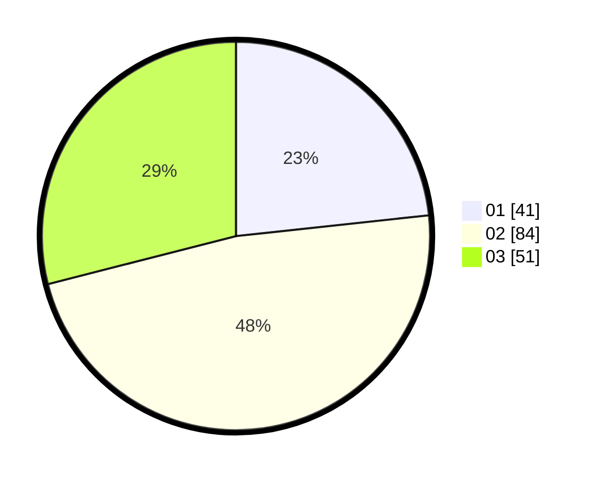

# Hasil

Hasil perolehan suara paslon dapat dilihat pada file paslon-01.txt, paslon-02.txt, dan paslon-03.txt.

Jika tidak ada, artinya data tersebut belum ada pada SIREKAP.

## Perolehan Suara

 * Paslon 01: **41**.
 * Paslon 02: **84**.
 * Paslon 03: **51**.

## Foto C Plano

https://sirekap-obj-formc.kpu.go.id/77a2/pemilu/ppwp/31/71/04/10/04/3171041004018-20240214-210704--b0c7aee1-8e81-4c8e-a2c6-dc927ce406fc.jpg

https://sirekap-obj-formc.kpu.go.id/77a2/pemilu/ppwp/31/71/04/10/04/3171041004018-20240214-210735--151ad906-d468-48ab-8721-6bd2bbf8b19d.jpg
