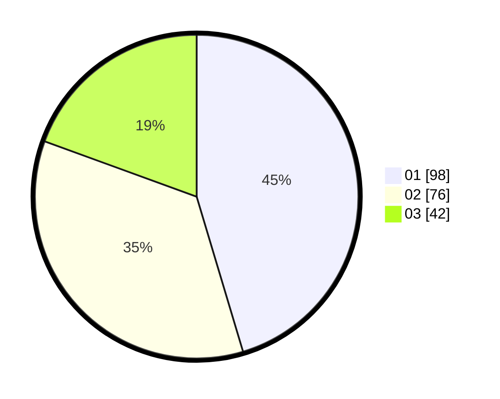

# Hasil

Hasil perolehan suara paslon dapat dilihat pada file paslon-01.txt, paslon-02.txt, dan paslon-03.txt.

Jika tidak ada, artinya data tersebut belum ada pada SIREKAP.

## Perolehan Suara

 * Paslon 01: **98**.
 * Paslon 02: **76**.
 * Paslon 03: **42**.

## Foto C Plano

https://sirekap-obj-formc.kpu.go.id/616b/pemilu/ppwp/31/71/04/10/04/3171041004021-20240214-193147--84e90dce-1ed1-4023-8989-1949f7514279.jpg

https://sirekap-obj-formc.kpu.go.id/616b/pemilu/ppwp/31/71/04/10/04/3171041004021-20240214-185735--c102b264-856c-4411-96ff-79e82f32dc88.jpg

https://sirekap-obj-formc.kpu.go.id/616b/pemilu/ppwp/31/71/04/10/04/3171041004021-20240214-185743--99735d7c-dd41-4ac8-9972-a4c1304a9721.jpg

## DATA PEMILIH TETAP

Jumlah pemilih dalam DPT: **276**.
 * L: **134**.
 * P: **142**.

## DATA PENGGUNA HAK PILIH

Jumlah pengguna hak pilih dalam DPT: **204**.
 * L: **96**.
 * P: **108**.

Jumlah pengguna hak pilih dalam DPTb: **12**.
 * L: **8**.
 * P: **4**.

Jumlah pengguna hak pilih dalam DPK: **2**.
 * L: **0**.
 * P: **2**.

Jumlah pengguna hak pilih: **218**.
 * L: **104**.
 * P: **114**.

## JUMLAH SUARA SAH DAN TIDAK SAH

JUMLAH SELURUH SUARA SAH: **216**.

JUMLAH SUARA TIDAK SAH: **2**.

JUMLAH SELURUH SUARA SAH DAN SUARA TIDAK SAH: **218**.
