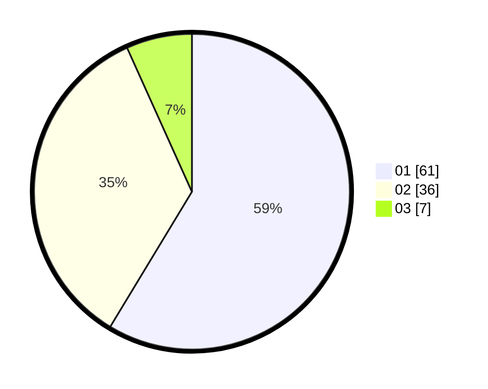

# Hasil

Hasil perolehan suara paslon dapat dilihat pada file paslon-01.txt, paslon-02.txt, dan paslon-03.txt.

Jika tidak ada, artinya data tersebut belum ada pada SIREKAP.

## Perolehan Suara

 * Paslon 01: **61**.
 * Paslon 02: **36**.
 * Paslon 03: **7**.

## Foto C Plano

https://sirekap-obj-formc.kpu.go.id/2dd1/pemilu/ppwp/31/71/04/10/04/3171041004022-20240214-192920--1ed13837-c4aa-48ac-8f5a-d4cde1038cbd.jpg

https://sirekap-obj-formc.kpu.go.id/2dd1/pemilu/ppwp/31/71/04/10/04/3171041004022-20240214-193108--72ede229-5f96-41f0-b253-4d6ae4dc197b.jpg

https://sirekap-obj-formc.kpu.go.id/2dd1/pemilu/ppwp/31/71/04/10/04/3171041004022-20240214-193409--f9ffba7e-e389-42f0-a089-bc6543acfbad.jpg

## DATA PEMILIH TETAP

Jumlah pemilih dalam DPT: **221**.
 * L: **112**.
 * P: **109**.

## DATA PENGGUNA HAK PILIH

Jumlah pengguna hak pilih dalam DPT: **101**.
 * L: **43**.
 * P: **58**.

Jumlah pengguna hak pilih dalam DPTb: **3**.
 * L: **0**.
 * P: **3**.

Jumlah pengguna hak pilih dalam DPK: **0**.
 * L: **0**.
 * P: **0**.

Jumlah pengguna hak pilih: **104**.
 * L: **43**.
 * P: **61**.

## JUMLAH SUARA SAH DAN TIDAK SAH

JUMLAH SELURUH SUARA SAH: **104**.

JUMLAH SUARA TIDAK SAH: **1**.

JUMLAH SELURUH SUARA SAH DAN SUARA TIDAK SAH: **105**.
