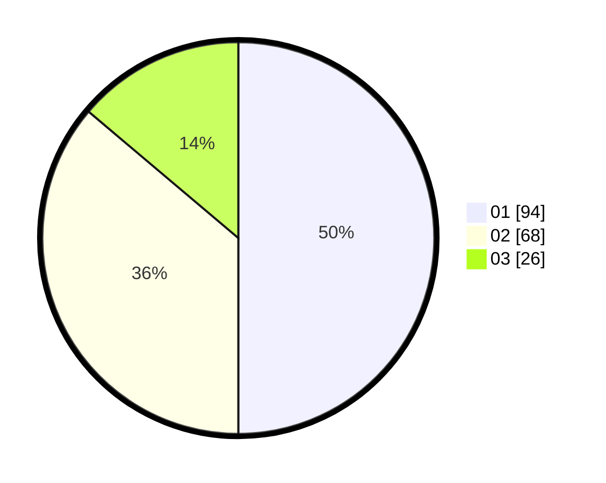

# Hasil

Hasil perolehan suara paslon dapat dilihat pada file paslon-01.txt, paslon-02.txt, dan paslon-03.txt.

Jika tidak ada, artinya data tersebut belum ada pada SIREKAP.

## Perolehan Suara

 * Paslon 01: **94**.
 * Paslon 02: **68**.
 * Paslon 03: **26**.

## Foto C Plano

https://sirekap-obj-formc.kpu.go.id/896e/pemilu/ppwp/31/71/04/10/04/3171041004024-20240214-232718--6c8f85d3-40f1-4d09-9376-6352bdf790fa.jpg

https://sirekap-obj-formc.kpu.go.id/896e/pemilu/ppwp/31/71/04/10/04/3171041004024-20240214-232948--98e40f2e-53a1-4b18-bae9-211f8e7757ca.jpg

https://sirekap-obj-formc.kpu.go.id/896e/pemilu/ppwp/31/71/04/10/04/3171041004024-20240214-233053--ce44c239-2e90-4603-b33c-e7678a56b5ce.jpg

## DATA PEMILIH TETAP

Jumlah pemilih dalam DPT: **265**.
 * L: **140**.
 * P: **125**.

## DATA PENGGUNA HAK PILIH

Jumlah pengguna hak pilih dalam DPT: **183**.
 * L: **91**.
 * P: **92**.

Jumlah pengguna hak pilih dalam DPTb: **4**.
 * L: **1**.
 * P: **3**.

Jumlah pengguna hak pilih dalam DPK: **4**.
 * L: **1**.
 * P: **3**.

Jumlah pengguna hak pilih: **191**.
 * L: **93**.
 * P: **98**.

## JUMLAH SUARA SAH DAN TIDAK SAH

JUMLAH SELURUH SUARA SAH: **188**.

JUMLAH SUARA TIDAK SAH: **3**.

JUMLAH SELURUH SUARA SAH DAN SUARA TIDAK SAH: **191**.
